# Corporate Learning System — High Level Architecture

**Document version:** 1.0  
**Date:** June 2, 2026  
**Project:** Corporate Learning Progress, Intervention & Compliance Tracking System  
**Purpose:** Fourth deliverable per evaluation rubric — High Level Architecture (10 marks)  
**Prerequisites:**  
- `Corporate_Learning_System_Problem_Statement_Analysis.md`  
- `Corporate_Learning_System_Use_Case_Documentation.md`  
- `Corporate_Learning_System_Test_Case_Documentation.md`

---

## Table of Contents

1. [Executive Summary](#1-executive-summary)
2. [Architecture Principles and Constraints](#2-architecture-principles-and-constraints)
3. [C4 Architecture Diagrams](#3-c4-architecture-diagrams)
4. [Logical Component Architecture](#4-logical-component-architecture)
5. [Technology Stack](#5-technology-stack)
6. [Alternatives Considered](#6-alternatives-considered)
7. [Data Architecture Overview](#7-data-architecture-overview)
8. [Rules Engine Design](#8-rules-engine-design)
9. [Integration Architecture](#9-integration-architecture)
10. [Non-Functional Requirements](#10-non-functional-requirements)
11. [Development Strategy](#11-development-strategy)
12. [Test and Deploy Strategy](#12-test-and-deploy-strategy)
13. [CI/CD and Continuous Testing (CI/CD/CT)](#13-cicd-and-continuous-testing-cicdct)
14. [Deployment Architecture](#14-deployment-architecture)
15. [Configuration and Rule Management](#15-configuration-and-rule-management)
16. [Evaluation Alignment](#16-evaluation-alignment)
17. [Rubric Self-Check](#17-rubric-self-check)
18. [Appendices](#18-appendices)

---

## 1. Executive Summary

The Corporate Learning Progress, Intervention & Compliance Tracking System is architected as a **modular monolith** deployed in **Docker containers**, backed by **PostgreSQL**, with a **React** web UI. The design enforces **clean separation of data ingestion/storage, rules evaluation, and reporting** — the primary evaluation parameter from the problem statement.

The system consumes attendance, assessment, and competency-milestone data from external LMS and assessment platforms via REST APIs, aggregates employee learning profiles, evaluates versioned JSON risk rules, tracks interventions, and produces compliance-ready exports. It is **not** a full corporate LMS; source systems remain systems of record.

**Recommended MVP deployment:** Docker Compose on a single VM (on-prem or cloud), with a path to Kubernetes if scale demands it.

---

## 2. Architecture Principles and Constraints

### 2.1 Guiding Principles

| Principle | Implementation |
|-----------|----------------|
| **Separation of concerns** | Three logical layers: Data Plane, Rules Plane, Reporting Plane |
| **API-first ingestion** | External systems push data; OpenAPI contract documented |
| **Deterministic rules** | Same profile + rule version → same risk outcome (audit reproducibility) |
| **Version everything that affects compliance** | Risk rules, report runs, risk assessments store version IDs |
| **Human-in-the-loop interventions** | System tracks; L&D/trainer assigns |
| **POC pragmatism** | Modular monolith over microservices for faster delivery |

### 2.2 Constraints (from Problem Statement)

| Constraint | Architectural response |
|------------|------------------------|
| Not a full LMS | No content delivery, SCORM, or course authoring modules |
| Rule-based risk only (MVP) | Pluggable rule evaluator; ML deferred to future scope |
| Configurable rules (JSON/YAML) | Rule Repository + JSON Schema validation |
| Simple dashboards | React SPA with focused L&D, trainer, compliance views |
| Batch ingestion acceptable | Scheduled jobs + optional near-real-time API |
| Single tenant POC | No multi-tenant isolation layer in MVP |

### 2.3 Three-Plane Model

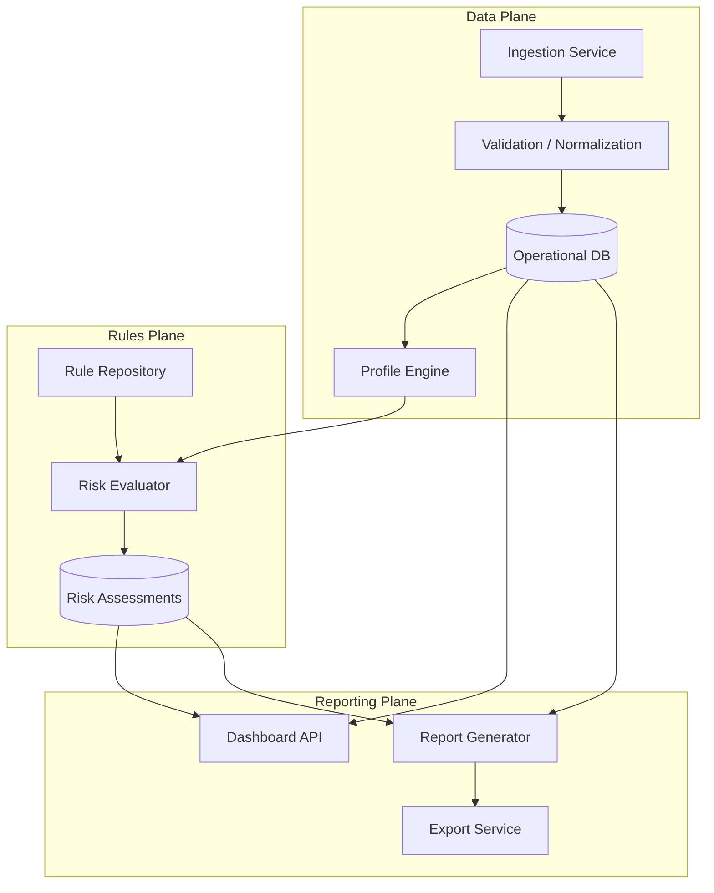

**Dependency rule:** Reporting and Rules read from Data Plane; Rules Plane does not embed report templates; Reporting does not embed rule logic.

---

## 3. C4 Architecture Diagrams

### 3.1 Level 1 — System Context

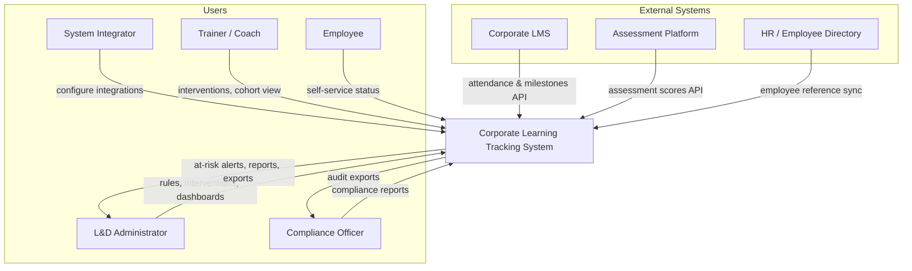

**System purpose:** Consolidate learning data, identify at-risk learners early, track intervention effectiveness, and support compliance reporting.

### 3.2 Level 2 — Container Diagram

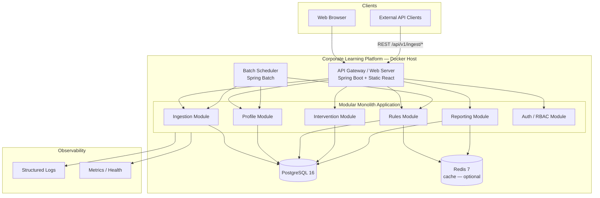

### 3.3 Level 3 — Component Diagram (Rules Module)

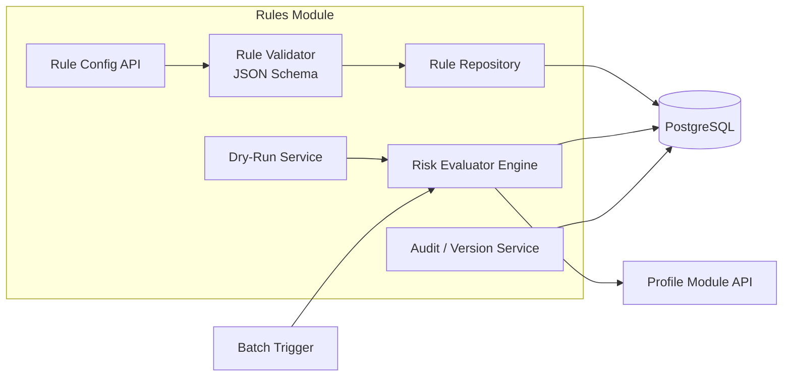

---

## 4. Logical Component Architecture

| Component | Plane | Responsibility | Key technologies |
|-----------|-------|----------------|------------------|
| **Ingestion Module** | Data | REST endpoints for attendance, assessments, milestones; validation; deduplication; error queue | Spring Web, Bean Validation, OpenAPI |
| **Profile Module** | Data | Aggregate roll-ups, competency gap calculation, profile snapshots | Spring Service, SQL aggregations |
| **Rules Module** | Rules | Rule CRUD, JSON Schema validation, batch evaluation, dry-run, versioning | Custom evaluator + Jackson, Spring Batch |
| **Intervention Module** | Data + cross-cutting | Intervention CRUD, lifecycle, outcome, effectiveness trigger | Spring Service |
| **Reporting Module** | Reporting | Compliance report generation, CSV/PDF export, audit queries | JasperReports or OpenPDF, CSV writer |
| **Dashboard API** | Reporting | Aggregated metrics for L&D, trainer, employee views | Spring REST, Redis cache |
| **Auth / RBAC Module** | Cross-cutting | JWT/OAuth2, role permissions per use case matrix | Spring Security |
| **Batch Scheduler** | Cross-cutting | Nightly ingestion reconciliation, profile refresh, risk run | Spring Batch, `@Scheduled` |

### 4.1 Request Flow — Ingestion to At-Risk Classification

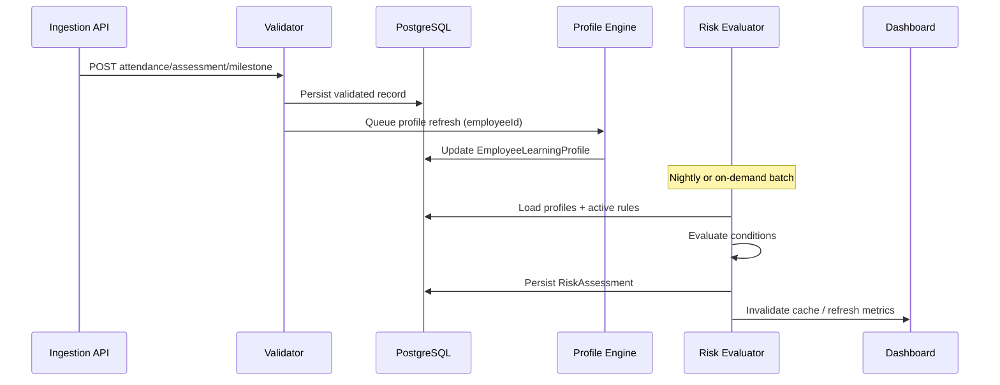

---

## 5. Technology Stack

### 5.1 Recommended Stack (MVP / POC)

| Layer | Choice | Version | Justification |
|-------|--------|---------|---------------|
| **Backend** | Java Spring Boot | 3.2+, Java 17 | Enterprise L&D fit; mature security, batch, validation; team familiarity in corporate environments |
| **API** | REST + OpenAPI | 3.0 | Contract-first ingestion; supports TC contract tests |
| **Database** | PostgreSQL | 16 | ACID for compliance; JSONB for rule storage; strong relational model for profiles |
| **Cache** | Redis | 7 | Dashboard metric cache; optional session store |
| **Batch** | Spring Batch | 5.x | Profile aggregation and risk runs at scale (1000+ employees) |
| **Frontend** | React + TypeScript | 18+ | Component reuse; fast dashboard development |
| **UI library** | Material UI (MUI) | 5.x | Accessible tables, filters for at-risk queue |
| **Auth** | Spring Security + JWT | — | RBAC aligned with use case matrix; SSO-ready |
| **Reporting export** | OpenPDF + Apache Commons CSV | — | Lightweight PDF/CSV without heavy license |
| **Container** | Docker + Docker Compose | — | Reproducible POC deployment |
| **CI/CD** | GitHub Actions | — | Build, test, scan, deploy pipeline |
| **Observability** | Micrometer + Prometheus + structured JSON logs | — | Health checks, batch duration metrics |

### 5.2 Stack Decision Rationale

| Requirement | Why this stack |
|-------------|----------------|
| Clean separation data / rules / reporting | Modular packages in one deployable JAR with enforced dependency rules |
| Configurable JSON rules | JSONB in PostgreSQL + JSON Schema validation in Rules Module |
| Competency progression | Relational milestone history + role-competency catalog tables |
| Compliance audit trail | PostgreSQL transactions + append-only audit tables |
| 1000 profiles in &lt; 2 min (TC-RISK-012) | Spring Batch chunk processing + indexed profile snapshots |
| Trainer/L&D usability | React dashboards with role-specific routes |
| POC delivery speed | Monolith avoids service mesh, distributed tracing complexity |

### 5.3 Module Package Structure (Modular Monolith)

```
com.corplearning/
├── ingestion/      # Data Plane — ingest only
├── profile/        # Data Plane — aggregation
├── rules/          # Rules Plane — no report code
├── intervention/   # Links data + rules outcomes
├── reporting/      # Reporting Plane — read-only to data/rules
├── auth/
├── common/
└── Application.java
```

**Enforcement:** `reporting` and `rules` packages must not depend on each other's implementation details — only on shared DTOs and data access interfaces.

---

## 6. Alternatives Considered

### 6.1 Alternative A — Microservices vs Modular Monolith

| Criterion | Modular monolith (chosen) | Microservices |
|-----------|---------------------------|---------------|
| Time to POC | ✓ Faster — single deployable | Slower — service boundaries, network contracts |
| Separation of concerns | ✓ Enforced via modules/m packages | ✓ Physical separation |
| Operational complexity | ✓ One container for MVP | Multiple services, service discovery, distributed transactions |
| Scalability | Vertical + batch tuning sufficient for 1000s of employees | Better for 100k+ and independent scaling |
| Team size (Tehnothon) | ✓ Small team friendly | Requires DevOps maturity |
| Compliance audit | ✓ Single DB transaction boundaries | Cross-service audit harder in MVP |

**Decision:** Modular monolith for MVP; extract **Rules Evaluator** or **Reporting** to separate service only if load tests fail SLA.

### 6.2 Alternative B — PostgreSQL vs MongoDB

| Criterion | PostgreSQL (chosen) | MongoDB |
|-----------|---------------------|---------|
| Relational profile data | ✓ Natural fit (employee, attendance, scores) | Embedding possible but joins awkward |
| Rule storage as JSON | ✓ JSONB + schema validation | ✓ Native documents |
| ACID / compliance | ✓ Strong transactions | Eventual consistency unless careful |
| Aggregation queries | ✓ SQL roll-ups for attendance % | Aggregation pipeline |
| Team / ops familiarity | ✓ Standard in enterprise | Common but less universal for compliance apps |
| Traceability joins | ✓ Risk ↔ Intervention ↔ Profile in one query | Multiple collections |

**Decision:** PostgreSQL with JSONB for rule definitions — best balance of relational integrity and flexible rule documents.

### 6.3 Alternative C — .NET vs Java (Brief)

| | Spring Boot | ASP.NET Core |
|---|-------------|--------------|
| Enterprise adoption | High | High |
| Batch processing | Spring Batch | Hangfire / custom |
| Decision | **Spring Boot** chosen for OpenAPI + Batch ecosystem alignment with implementation guide patterns | Viable alternative if team is .NET-first |

---

## 7. Data Architecture Overview

### 7.1 Core Entity Relationships

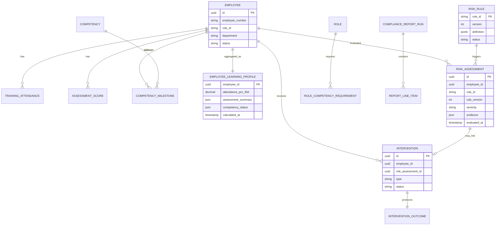

### 7.2 Data Plane vs Rules Plane Storage

| Store | Tables / artifacts | Owned by |
|-------|---------------------|----------|
| **Operational data** | employees, attendance, assessments, milestones, profiles, interventions | Data Plane modules |
| **Rule definitions** | risk_rules, risk_rule_versions | Rules Module |
| **Rule outcomes** | risk_assessments, at_risk_classifications | Rules Module (writes); Reporting (reads) |
| **Report artifacts** | compliance_report_runs, export_audit_log | Reporting Module |
| **Audit** | audit_log (append-only) | Cross-cutting |

---

## 8. Rules Engine Design

### 8.1 Rule Definition Format (JSON Schema — MVP)

Rules are stored in `risk_rules.definition` (JSONB). Minimal schema:

```json
{
  "$schema": "https://corp-learning.local/schemas/risk-rule/v1",
  "ruleId": "R-ATT-01",
  "ruleName": "Low Mandatory Training Attendance",
  "description": "Attendance below 75% in last 30 days on mandatory courses",
  "severity": "HIGH",
  "priority": 100,
  "status": "active",
  "conditions": {
    "operator": "AND",
    "criteria": [
      {
        "metric": "attendance_percentage",
        "scope": "mandatory_courses",
        "period": "30_days",
        "operator": "less_than",
        "value": 75
      }
    ]
  },
  "applicableTo": {
    "roles": ["all"],
    "competencies": "all",
    "departments": "all"
  },
  "actions": {
    "classify": true,
    "notifyRoles": ["LND_ADMIN"]
  }
}
```

### 8.2 Supported Metrics (MVP)

| Metric | Source | Used for |
|--------|--------|----------|
| `attendance_percentage` | Profile roll-up | R-ATT-* rules |
| `consecutive_assessment_scores` | Assessment history | R-SCR-* rules |
| `competency_level_gap` | Milestone vs role requirement | R-MS-* rules |
| `latest_assessment_percentage` | Latest score | Composite rules |

### 8.3 Evaluator Behavior

1. Load **active** rules (status=active, effectiveDate ≤ now).  
2. For each employee profile, filter rules by `applicableTo`.  
3. Evaluate `conditions` tree (AND/OR).  
4. Persist `RiskAssessment` with **rule_version** and **evidence** JSON.  
5. Compute composite level: max(severity) → Low | Medium | High | Critical.  
6. Skip inactive employees (FR-15).

**Dry-run:** Same evaluator with `persist=false` (UC-RISK-002, TC-RISK-003).

---

## 9. Integration Architecture

### 9.1 Ingestion API Endpoints (External → System)

| Method | Endpoint | Auth | Payload |
|--------|----------|------|---------|
| POST | `/api/v1/ingest/attendance` | API Key / mTLS | Batch attendance records |
| POST | `/api/v1/ingest/assessments` | API Key | Batch assessment scores |
| POST | `/api/v1/ingest/milestones` | API Key | Competency milestone events |
| POST | `/api/v1/ingest/employees/sync` | API Key | Employee reference upsert |

**OpenAPI spec** published at `/api/v1/openapi.yaml` — drives contract tests (TC-INGEST-*).

### 9.2 Integration Patterns

| Pattern | Usage |
|---------|-------|
| **Push API** | LMS and assessment platforms POST batches (primary) |
| **Scheduled pull** | Optional future: poll LMS export endpoint |
| **Idempotency** | Business key: employeeId + sessionId + date (attendance) |
| **Error handling** | Failed records → `ingestion_error_queue` table; UC-INGEST-005 |
| **No bi-directional LMS sync** | This system is consumer, not system of record |

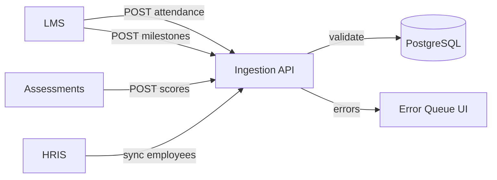

---

## 10. Non-Functional Requirements

### 10.1 Security

| NFR | Target | Implementation |
|-----|--------|----------------|
| Authentication | All human users authenticated | JWT / SSO adapter |
| Authorization | RBAC per use case matrix | Spring Security method + URL rules |
| API ingestion auth | Service accounts only | API keys rotated; scoped to ingest endpoints |
| PII protection | Trainers see masked fields | Field-level DTO masking in Profile API |
| Encryption in transit | TLS 1.2+ | Reverse proxy (nginx) terminates TLS |
| Encryption at rest | DB volume encryption | Cloud disk encryption or LUKS on-prem |
| Audit | All rule changes and exports logged | `audit_log` append-only table |
| GDPR alignment | Data minimization, access control | Role scoping; retention policy (architecture TBD) |

### 10.2 Scalability and Performance

| NFR | Target | Implementation |
|-----|--------|----------------|
| Risk batch (1000 employees) | &lt; 2 minutes | Spring Batch; indexed profiles; TC-RISK-012 |
| Dashboard load | &lt; 3 s p95 | Redis cached aggregates; pagination |
| Ingestion throughput | 500 records/min | Async profile queue; batch inserts |
| Concurrent users (POC) | 50 | Single instance sufficient |
| Growth path | 10k employees | Read replicas; optional rules worker split |

### 10.3 Availability and Reliability

| NFR | POC target | Production path |
|-----|------------|-----------------|
| Uptime | 99% (business hours) | HA PostgreSQL, multi-instance app |
| Backup | Daily DB snapshot | Point-in-time recovery |
| Recovery | RTO 4 h / RPO 24 h | Automated restore runbook |

### 10.4 Observability

| Signal | Tool | Key metrics |
|--------|------|-------------|
| **Logs** | JSON → stdout / Loki | ingestion errors, rule run duration |
| **Metrics** | Micrometer → Prometheus | `risk.batch.duration`, `ingest.records.failed` |
| **Health** | Spring Actuator `/actuator/health` | DB, Redis, disk |
| **Tracing** | Optional OpenTelemetry | Request ID across ingest → profile |

---

## 11. Development Strategy

### 11.1 Environments

| Environment | Purpose | Data | Deploy target |
|-------------|---------|------|---------------|
| **Local (dev)** | Developer workstations | H2 or local PostgreSQL; seed scripts | Docker Compose |
| **Test / QA** | Automated + manual QA | Anonymized seed + TC datasets | Shared test VM |
| **Staging** | UAT, demo rehearsal | Production-like volume | Staging VM / cloud |
| **Production** | Live POC / pilot | Real integrations | Production VM / cloud |

### 11.2 Branching and Release Model

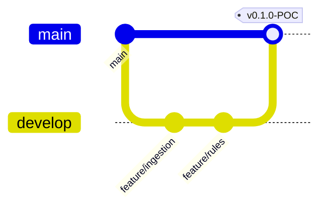

| Branch | Policy |
|--------|--------|
| `main` | Production-ready; protected |
| `develop` | Integration branch |
| `feature/*` | Short-lived; PR required |
| `release/*` | Stabilization before tag |

### 11.3 Development Phases (aligned to POC)

| Phase | Deliverable | Duration (illustrative) |
|-------|-------------|-------------------------|
| 1 | Ingestion API + DB schema + employee sync | Week 1 |
| 2 | Profile engine + competency catalog | Week 2 |
| 3 | Rules module + batch evaluator | Week 3 |
| 4 | Interventions + dashboards | Week 4 |
| 5 | Compliance reporting + export | Week 5 |
| 6 | Hardening, performance, deployment docs | Week 6 |

### 11.4 Local Developer Setup

```bash
git clone <repo>
cd propeller-architect
docker compose up -d postgres redis
./mvnw spring-boot:run -Dspring-boot.run.profiles=local
cd frontend && npm install && npm run dev
```

---

## 12. Test and Deploy Strategy

### 12.1 Test Strategy Alignment

Architecture enables test levels defined in `Corporate_Learning_System_Test_Case_Documentation.md`:

| Test level | Architectural enabler |
|------------|----------------------|
| Unit | Pure rule evaluator, profile calculators (no DB) |
| Integration | `@SpringBootTest` + Testcontainers PostgreSQL |
| API contract | OpenAPI + Schemathesis or Postman Newman |
| Rules golden files | `src/test/resources/rules/*.json` + RE-POS/NEG fixtures |
| E2E | Cypress or Playwright against staging |
| Performance | k6 against `/api/internal/risk/batch` |

### 12.2 Deployment Strategy

| Aspect | Approach |
|--------|----------|
| **Packaging** | Backend: Spring Boot fat JAR in Docker image; Frontend: static build served by nginx or Spring |
| **Orchestration (POC)** | Docker Compose: `app`, `postgres`, `redis`, `nginx` |
| **Orchestration (scale)** | Kubernetes Deployment + Helm chart (future) |
| **Database migrations** | Flyway versioned SQL in `src/main/resources/db/migration` |
| **Secrets** | Environment variables / Docker secrets; never in Git |
| **Health checks** | Docker `HEALTHCHECK` → Actuator `/actuator/health` |
| **Rollback** | Previous Docker image tag; Flyway backward-compatible migrations only |
| **Zero-downtime (POC)** | Accept brief restart; blue-green optional for prod |

### 12.3 Release Checklist

1. All CI stages green (build, unit, integration, contract, smoke).  
2. Flyway migrations applied on staging.  
3. TC smoke subset (Appendix B of test doc) passed on staging.  
4. Performance: TC-RISK-012 within SLA.  
5. Deployment guide updated.  
6. Tag release; deploy to production VM.

---

## 13. CI/CD and Continuous Testing (CI/CD/CT)

### 13.1 Pipeline Overview

```mermaid
flowchart LR
    subgraph CI[GitHub Actions — on PR and main]
        A[Checkout] --> B[Build Backend]
        B --> C[Unit Tests]
        C --> D[Integration Tests<br/>Testcontainers]
        D --> E[Contract Tests<br/>OpenAPI]
        E --> F[Rules Golden Files]
        F --> G[Frontend Build + Lint]
        G --> H[Security Scan<br/>OWASP Dependency Check]
        H --> I[Docker Image Build]
    end
    subgraph CD[Deploy — main only]
        I --> J[Push to Registry]
        J --> K[Deploy Staging]
        K --> L[Smoke Tests]
        L --> M[Manual Approval]
        M --> N[Deploy Production]
    end
```

### 13.2 Pipeline Stages

| Stage | Trigger | Actions | Fail criteria |
|-------|---------|---------|---------------|
| **Build** | Every PR | `mvn package`, `npm run build` | Compile failure |
| **Unit test** | Every PR | JUnit 5; ≥80% on rules + profile modules | Any failure |
| **Integration** | Every PR | Testcontainers PostgreSQL | Ingestion → profile chain fails |
| **Contract** | Every PR | Validate API against OpenAPI | Schema mismatch |
| **Rules CT** | Every PR | RE-POS-*, RE-NEG-* golden tests | Wrong fire/no-fire |
| **Security scan** | Every PR | OWASP dependency check, `npm audit` | Critical CVE |
| **Docker build** | merge to `develop` | Build and tag image | Build failure |
| **Deploy staging** | merge to `main` | `docker compose pull && up -d` on staging VM | Health check fail |
| **Smoke E2E** | post staging deploy | TC-INGEST-001, TC-RISK-004, TC-REPORT-001 | Any smoke fail |
| **Deploy prod** | manual approval | Same compose on prod VM | Health check fail |

### 13.3 Continuous Testing (CT) Strategy

| CT type | What runs | When |
|---------|-----------|------|
| **Rules golden files** | Fixed profile fixtures → expected fire/no-fire | Every PR; blocks merge on drift |
| **Contract tests** | Ingestion API request/response vs OpenAPI | Every PR |
| **Smoke suite** | 8 tests from test doc Appendix B | Every staging deploy |
| **Full regression** | All 38 TC-* (automated where possible) | Weekly + pre-release |
| **Performance gate** | k6: 1000 profiles / 5 rules | Pre-demo and release candidate |

### 13.4 Sample GitHub Actions Workflow (excerpt)

```yaml
name: CI
on: [push, pull_request]
jobs:
  backend:
    runs-on: ubuntu-latest
    steps:
      - uses: actions/checkout@v4
      - uses: actions/setup-java@v4
        with: { java-version: '17', distribution: 'temurin' }
      - run: ./mvnw verify -Pintegration-tests
      - run: ./mvnw test -Dtest=RulesGoldenFileTest
  frontend:
    runs-on: ubuntu-latest
    steps:
      - run: npm ci && npm run lint && npm run build
  docker:
    needs: [backend, frontend]
    if: github.ref == 'refs/heads/main'
    steps:
      - run: docker build -t corp-learning:${{ github.sha }} .
```

---

## 14. Deployment Architecture

### 14.1 POC Deployment — Docker Compose (Cloud or On-Prem VM)

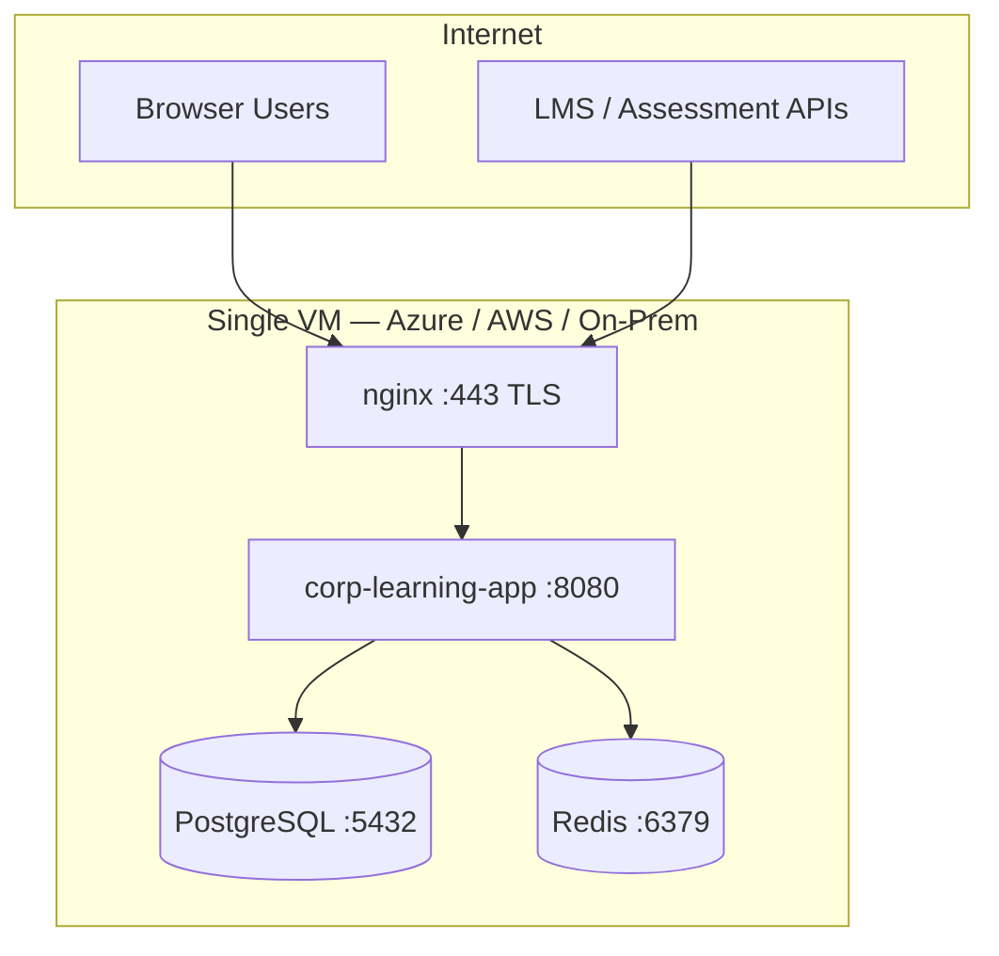

### 14.2 Docker Compose Services

| Service | Image | Ports | Volumes |
|---------|-------|-------|---------|
| `nginx` | nginx:alpine | 443, 80 | TLS certs |
| `app` | corp-learning:latest | 8080 (internal) | — |
| `postgres` | postgres:16-alpine | 5432 (internal) | `pgdata` |
| `redis` | redis:7-alpine | 6379 (internal) | — |

### 14.3 Deployment Steps (Reproducible POC)

```bash
# 1. Clone and configure
git clone <repo> && cd propeller-architect
cp .env.example .env   # set DB password, JWT secret, API keys

# 2. Build and start
docker compose build
docker compose up -d

# 3. Verify health
curl -k https://localhost/actuator/health

# 4. Seed demo data (optional)
docker compose exec app java -jar app.jar --seed-demo

# 5. Access UI
open https://localhost
```

### 14.4 Rollback Procedure

```bash
docker compose down
export APP_IMAGE=corp-learning:<previous-sha>
docker compose up -d
# Verify health; restore DB snapshot only if migration failed
```

---

## 15. Configuration and Rule Management

### 15.1 Configuration Categories

| Category | Storage | Change process |
|----------|---------|----------------|
| **Application config** | `application.yml` + env vars | DevOps PR; redeploy |
| **Risk rules** | PostgreSQL `risk_rules` + JSONB | L&D UI → validated → versioned (UC-RISK-006) |
| **Competency catalog** | PostgreSQL tables | L&D Admin UI (UC-ADMIN-001) |
| **RBAC roles** | DB seed + Security config | Admin PR for new permissions |
| **API keys (ingestion)** | Secrets manager / `.env` | Integrator rotation policy |

### 15.2 Rule Versioning Workflow

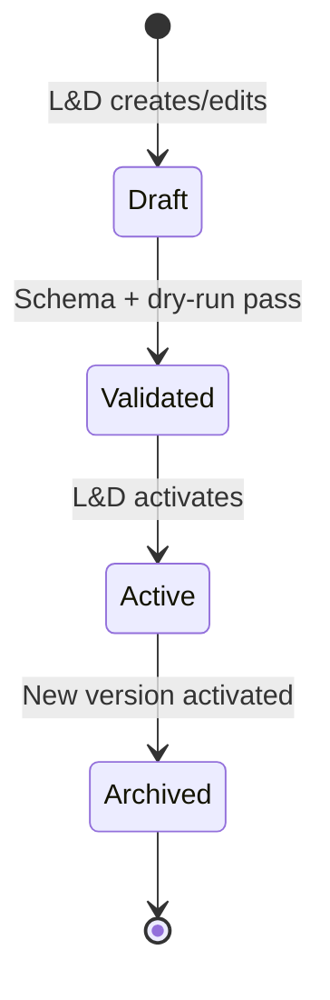

- Each activation increments `version`.  
- `RiskAssessment` stores `rule_id` + `rule_version`.  
- Compliance reports include rule versions used in period (TC-RISK-010).  
- Archived rules never deleted — audit retention.

### 15.3 Feature Flags (Optional)

| Flag | Purpose |
|------|---------|
| `risk.batch.enabled` | Disable batch for maintenance |
| `ingest.strict.validation` | Reject vs quarantine bad records |
| `dashboard.cache.enabled` | Toggle Redis cache |

---

## 16. Evaluation Alignment

| Evaluation parameter | Architectural support |
|---------------------|----------------------|
| **Realism of competency rules** | Metric model includes `competency_level_gap`; catalog + milestone history (Section 8) |
| **Correct competency progression** | Append-only milestone table; profile computes gap to role requirement (Section 7) |
| **Practical usefulness for trainers/L&D** | Role-specific React dashboards; at-risk queue API (Section 5) |
| **Clean separation of data, rules, reporting** | Three-plane model; module dependency rules (Sections 2.3, 5.3) |

---

## 17. Rubric Self-Check

Mapping to **Expectations.txt** — High Level Architecture (10 marks total):

| Criterion | Max | How this document addresses it |
|-----------|-----|--------------------------------|
| **Tech stack choice** | 2 | Section 5: full stack table with justification |
| **Alternatives and rationale** | 2 | Section 6: monolith vs microservices, PostgreSQL vs MongoDB, .NET vs Java |
| **Architecture diagrams** | 2 | Section 3: C4 Context + Container; Section 4, 7, 9, 14: component, ER, integration, deployment |
| **Dev/Test/Deploy strategy** | 2 | Sections 11–12: environments, branching, phases, test alignment, deployment checklist |
| **CI/CD/CT strategy** | 2 | Section 13: pipeline diagram, stages, golden files, smoke suite, sample workflow |

---

## 18. Appendices

### Appendix A — Technology Stack Summary Card

| Layer | Technology |
|-------|------------|
| Frontend | React 18, TypeScript, MUI 5 |
| Backend | Spring Boot 3.2, Java 17 |
| Database | PostgreSQL 16 |
| Cache | Redis 7 |
| Batch | Spring Batch 5 |
| API docs | OpenAPI 3 |
| Auth | Spring Security, JWT |
| Containers | Docker, Docker Compose |
| CI/CD | GitHub Actions |
| Migrations | Flyway |

### Appendix B — API Module Ownership

| API prefix | Module | Plane |
|------------|--------|-------|
| `/api/v1/ingest/*` | Ingestion | Data |
| `/api/v1/profiles/*` | Profile | Data |
| `/api/v1/rules/*` | Rules | Rules |
| `/api/v1/risk/*` | Rules | Rules |
| `/api/v1/interventions/*` | Intervention | Data |
| `/api/v1/reports/*` | Reporting | Reporting |
| `/api/v1/dashboard/*` | Reporting | Reporting |

### Appendix C — Document History

| Version | Date | Author | Changes |
|---------|------|--------|---------|
| 1.0 | 2026-06-02 | Project team | Initial high-level architecture for evaluation Step 4 |

### Appendix D — Next Steps (Project Pipeline)

Per evaluation rubric:

1. **POC** — Implement modular monolith per this architecture; execute test cases; provide deployment instructions and known issues  
2. **Presentation** — Solution overview, demo, team contributions, future scope  

Optional deep-dive (architect role evidence): full ERD DDL, security architecture, sample rule library (15+ rules) per Architecture Review Process.

---

*End of document*
