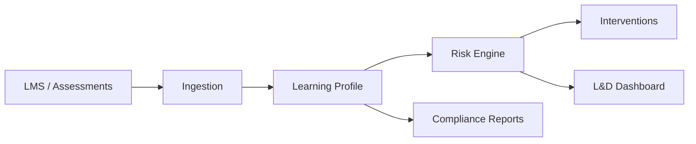

# Corporate Learning System — Presentation Guide

**Document version:** 1.0  
**Date:** June 2, 2026  
**Project:** Corporate Learning Progress, Intervention & Compliance Tracking System  
**Purpose:** Sixth deliverable per evaluation rubric — Presentation (10 marks)  
**Suggested duration:** 15–18 minutes + Q&A

---

## Table of Contents

1. [Presentation Overview](#1-presentation-overview)
2. [Slide Deck (15 Slides)](#2-slide-deck-15-slides)
3. [Live Demo Script (3 Minutes)](#3-live-demo-script-3-minutes)
4. [Architecture Talking Points](#4-architecture-talking-points)
5. [Future Scope Slide Content](#5-future-scope-slide-content)
6. [Anticipated Q&A](#6-anticipated-qa)
7. [Team Roles and Work Distribution](#7-team-roles-and-work-distribution)
8. [Presenter Assignments](#8-presenter-assignments)
9. [Pre-Demo Checklist](#9-pre-demo-checklist)
10. [Rubric Self-Check](#10-rubric-self-check)

---

## 1. Presentation Overview

| Section | Time | Judge criterion |
|---------|------|-----------------|
| Problem statement and work distribution | 2 min | Problem statement and work distribution |
| Solution overview | 2 min | Solution and architecture overview |
| Architecture overview | 2 min | Solution and architecture overview |
| POC demo | 3 min | POC demo |
| Future scope | 2 min | Future scope |
| Q&A | 5+ min | Q&A |

**Opening line (Architect):**

> "Organizations must prove employees meet competencies and compliance requirements — but learning data lives in silos. We built a consolidation and early-intervention layer, not a full LMS, that flags at-risk learners early and tracks interventions with audit-ready reporting."

---

## 2. Slide Deck (15 Slides)

### Slide 1 — Title

**Title:** Corporate Learning Progress, Intervention & Compliance Tracking System  
**Subtitle:** Tehnothon Propeller — Architect Track  
**Footer:** Team name | Date | Repository URL

**Speaker note:** Introduce team names briefly; state this is a risk-detection and compliance layer, not an LMS replacement.

---

### Slide 2 — The Problem (30 sec)

**Headline:** Learning data is fragmented; intervention comes too late

**Bullets:**
- Accountability for training attendance, assessments, and competency outcomes
- Data scattered across LMS, assessment tools, trainer notes
- At-risk employees detected after audits or failed certifications
- Interventions are reactive and hard to measure

**Visual:** As-is diagram from Problem Statement Analysis (manual merge → late detection)

**Speaker note:** Tie to one real consequence — compliance exposure, safety certification gaps, or audit fire drills.

---

### Slide 3 — Scope: In vs Out (30 sec)

**In scope:**
- API ingestion: attendance, assessments, competency milestones
- Configurable rule-based risk identification
- Intervention tracking (remedial + coaching)
- Compliance-ready reporting and dashboards

**Out of scope:**
- Full corporate LMS, SCORM, course authoring
- ML predictive risk (MVP)
- Payroll / performance management

**Speaker note:** Explicitly say "we are not building a full LMS" — judges expect this boundary.

---

### Slide 4 — Team and Work Distribution (1 min)

**Table:** See [Section 7](#7-team-roles-and-work-distribution)

**Speaker note:** Each member states name, role, and one sentence on their deliverable. Architect owns analysis → HLD → POC alignment.

---

### Slide 5 — Solution Overview (1 min)

**Headline:** Consolidate → Evaluate → Intervene → Report



**Must-haves delivered:**
- Employee learning profile (single view)
- JSON-configurable rules
- At-risk classification
- Intervention history
- Simple dashboards + export

**Speaker note:** Emphasize **clean separation of data, rules, and reporting** — explicit evaluation parameter.

---

### Slide 6 — Architecture Overview (1.5 min)

**Pattern:** Modular monolith (Spring Boot + PostgreSQL)

**Three planes:**

| Plane | Responsibility | POC module |
|-------|----------------|------------|
| Data | Ingestion, profiles, milestones | Ingestion + Profile |
| Rules | JSON rules, batch evaluation | Risk Engine |
| Reporting | Dashboards, compliance export | Reporting |

**Tech stack:** Java 11, Spring Boot 2.7, PostgreSQL (Docker), Flyway, REST/OpenAPI

**Speaker note:** Chosen for POC speed; HLD documents path to Java 17, Redis cache, CI/CD.

---

### Slide 7 — Data Architecture (1 min)

**Entities:** Employee, TrainingAttendance, AssessmentScore, CompetencyMilestone, EmployeeLearningProfile

**Competency progression:**
- Role → required competency level (e.g., Forklift L3)
- Milestones ingested as first-class events
- Profile shows gap: achieved vs required

**Speaker note:** "We don't infer competency from course completion alone — milestones are explicit."

---

### Slide 8 — Rules Engine (1 min)

**Format:** JSON rules, versioned, auditable

**Sample rule types (5 in POC):**

| Rule | Logic | Severity |
|------|-------|----------|
| R-ATT-01 | Mandatory attendance &lt; 75% | HIGH |
| R-SCR-01 | 2 consecutive scores &lt; 60% | HIGH |
| R-MS-01 | Milestone not met by target date | CRITICAL |
| R-CMP-01 | Low attendance AND low score | MEDIUM |

**Speaker note:** Deterministic — same inputs + rule version → same outcome (audit reproducibility).

---

### Slide 9 — Integration & Security (45 sec)

**Ingestion:** REST POST with `X-API-Key`; OpenAPI at `/swagger-ui.html`

**Sources remain systems of record** — we consume, not replace LMS

**RBAC (design):** L&D configures rules; Compliance exports reports; Trainers assign interventions — full RBAC in roadmap

**Speaker note:** POC has API key on ingest; human APIs open for demo simplicity — documented as known limitation.

---

### Slide 10 — Deliverables Summary (30 sec)

| Step | Document | Status |
|------|----------|--------|
| 1 | Problem Statement Analysis | ✓ |
| 2 | Use Case Documentation (26 UCs) | ✓ |
| 3 | Test Case Documentation (38+ tests) | ✓ |
| 4 | High Level Architecture | ✓ |
| 5 | Working POC + README | ✓ |
| 6 | This presentation | ✓ |

---

### Slide 11 — POC Demo Intro (15 sec)

**Headline:** Live Demo — Early At-Risk Detection in Action

**Setup:** App running at http://localhost:8080  
**Seeded:** 5 employees, 5 rules, 5 at-risk classifications

**Hand off to demo presenter**

---

### Slide 12 — Demo Flow (reference slide — optional during live demo)

1. L&D dashboard — metrics and at-risk counts  
2. At-risk queue — severity and rule evidence  
3. Employee profile — attendance + scores + competency gap  
4. Assign intervention (API or describe)  
5. Compliance report + CSV export  

---

### Slide 13 — Demo Results (post-demo)

**Expected numbers (seeded data):**
- Active employees: 5
- At-risk: 5 (4 CRITICAL, 1 HIGH)
- Active rules: 5
- Example: Jamie Brooks — low attendance + milestone gap

**Speaker note:** If live demo fails, show screenshot or curl output prepared in [Pre-Demo Checklist](#9-pre-demo-checklist).

---

### Slide 14 — Future Scope (1.5 min)

**Near term:**
- Full RBAC / SSO
- Rule simulation UI for L&D
- Email/Teams alerts on new at-risk flags
- CSV import fallback alongside APIs

**Medium term:**
- Trend-based rules (declining scores)
- Manager self-service views
- PDF compliance reports with audit watermark

**Long term:**
- ML-assisted risk with explainability on rule engine
- Multi-region regulatory rule packs
- Kubernetes deployment, horizontal scale

**Speaker note:** Frame future work as roadmap, not scope creep.

---

### Slide 15 — Thank You / Q&A

**Headline:** Questions?

**Backup bullets if silence:**
- Why modular monolith vs microservices?
- How do you handle false positives?
- How does competency progression work?
- Why not build a full LMS?

**Contact:** Repository URL | Architect email

---

## 3. Live Demo Script (3 Minutes)

**Before starting:** Confirm app is running (`curl http://localhost:8080/actuator/health`).

### Minute 0:00 — Dashboard (45 sec)

1. Open **http://localhost:8080**
2. Point out:
   - Active employees: **5**
   - At-risk count: **5**
   - Active rules: **5**
   - Ingestion errors: **0**
3. Scroll to **At-Risk Queue** table
4. Say: *"Jamie Brooks is CRITICAL — fired rules for low mandatory attendance and milestone slip."*

### Minute 0:45 — Profiles (45 sec)

1. Scroll to **Employee Profiles** table
2. Highlight **EMP-RISK-ATT-01**: 70% mandatory attendance
3. Highlight **EMP-RISK-SCR-01**: consecutive low scores (58%, 55%)
4. Say: *"One profile consolidates attendance, assessments, and competency gaps — no manual Excel merge."*

**Optional API call (if browser + terminal):**

```bash
curl http://localhost:8080/api/v1/profiles/2
```

### Minute 1:30 — Risk engine (30 sec)

1. Click **Run Risk Evaluation** on dashboard (or):

```bash
curl -X POST http://localhost:8080/api/v1/risk/evaluate
```

2. Say: *"Batch evaluator runs configurable JSON rules — deterministic and versioned for audit."*

### Minute 2:00 — Intervention (30 sec)

```bash
curl -X POST http://localhost:8080/api/v1/interventions ^
  -H "Content-Type: application/json" ^
  -d "{\"employeeId\":2,\"type\":\"REMEDIAL\",\"assignee\":\"Trainer A\",\"scheduledDate\":\"2026-06-10\",\"notes\":\"Mandatory safety refresher\"}"
```

Say: *"L&D assigns remedial training linked to the risk event; outcomes feed back into compliance evidence."*

### Minute 2:30 — Compliance export (30 sec)

```bash
curl -X POST http://localhost:8080/api/v1/reports/compliance ^
  -H "Content-Type: application/json" ^
  -d "{\"periodStart\":\"2026-01-01\",\"periodEnd\":\"2026-06-30\",\"department\":\"Operations\"}"
```

Note the `id` in response, then:

```bash
curl http://localhost:8080/api/v1/reports/1/export -o compliance.csv
```

Say: *"Compliance officer gets exportable evidence — risk levels, interventions, rule versions used."*

### Minute 3:00 — Close demo

*"This demonstrates the full loop: ingest → profile → rules → at-risk → intervention → report — without replacing your LMS."*

---

## 4. Architecture Talking Points

Use these if judges ask for depth during architecture section:

| Topic | Answer (30 sec) |
|-------|-----------------|
| **Why modular monolith?** | Faster POC delivery; enforced package separation (data/rules/reporting); extract services later if load requires |
| **Why PostgreSQL?** | ACID for compliance; relational profiles + JSONB for rules |
| **Why rule-based not ML?** | Problem statement requires transparent, configurable rules first; ML as future layer |
| **Scalability** | Batch target: 1000 profiles in &lt; 2 min; Spring Batch + indexed profiles in HLD |
| **Separation of concerns** | Rules module never embeds report templates; reporting reads materialized snapshots |

---

## 5. Future Scope Slide Content

**Problem statement alignment:** Items from analysis Section 7, prioritized for judges:

1. **Operational:** Notifications, CSV import, rule dry-run UI  
2. **Governance:** Full RBAC, PDF exports, retention policies  
3. **Analytics:** Trend rules, department heat maps, intervention effectiveness dashboards  
4. **Platform:** Java 17 / Boot 3 upgrade, Kubernetes, Redis cache, GitHub Actions CI/CD  
5. **Innovation:** Explainable ML risk scores layered on rule engine  

---

## 6. Anticipated Q&A

### Q1: Why not build a full LMS?

**A:** The problem statement explicitly excludes a full LMS. Organizations already have LMS and assessment tools. Our system is a **consolidation and risk layer** that ingests their data, flags at-risk learners early, tracks interventions, and produces compliance evidence — without duplicating course delivery.

---

### Q2: How do you prevent false positives / alert fatigue?

**A:** Three mechanisms: (1) **configurable thresholds** — L&D sets attendance % and score cutoffs; (2) **rule dry-run** before activation; (3) **severity levels** (Low → Critical) so teams prioritize. Future: deduplication windows and composite rules requiring multiple signals.

---

### Q3: How is competency-level progression handled?

**A:** Milestones are **first-class ingested data**, not derived from course completion. We maintain a competency catalog, role requirements (e.g., Forklift L3 for warehouse operators), and compare achieved level vs required level. Rule R-MS-01 fires when target date passes without required level.

---

### Q4: How is compliance / audit supported?

**A:** Deterministic rules with **version IDs** stored on each risk assessment. Compliance reports include rule versions, employee risk history, and intervention trail. Exports are CSV today; PDF with watermark on roadmap. Re-running the same data + rule version reproduces the same classification.

---

### Q5: Why modular monolith instead of microservices?

**A:** Tehnothon timeline and team size favor one deployable unit with **strict module boundaries** (data / rules / reporting packages). Microservices add operational overhead without benefit at POC scale (~1000 employees). HLD defines extraction triggers if load tests fail SLA.

---

### Q6: What about data privacy (GDPR / PII)?

**A:** Design includes RBAC, trainer PII masking, audit logs, and encryption in transit (TLS). POC uses demo data; production would add retention policies, SSO, and field-level access per use case matrix (Section 8 of Use Case doc).

---

### Q7: Can L&D change rules without a code deploy?

**A:** Yes — rules are JSON documents stored in DB, edited via API (UI on roadmap). Activation creates a new version; prior version archived for audit. Mid-quarter rule changes apply only to new evaluation runs; historical assessments retain original rule version.

---

### Q8: What if ingestion fails or employee ID is unknown?

**A:** Failed records go to an **ingestion error queue**; integrator reconciles and replays. Unknown employees return HTTP 422 — no silent data corruption. Dashboard shows ingestion error count.

---

### Q9: How do you measure intervention effectiveness?

**A:** After outcome is recorded, post-intervention data is re-ingested, rules re-run, and risk level compared before vs after. Effectiveness marked improved / unchanged / worsened — closes the loop from problem statement.

---

### Q10: What would you do differently with more time?

**A:** (1) Full RBAC and React dashboard, (2) PostgreSQL + CI pipeline with golden rule tests on every PR, (3) 15+ production rule library, (4) performance test at 1000 employees, (5) upgrade to Java 17 / Spring Boot 3 per HLD.

---

## 7. Team Roles and Work Distribution

**Update with your actual team names before presenting.**

| Team member | Role | Contributions | Artifacts |
|-------------|------|---------------|-----------|
| _[Name 1]_ | **Software Architect** | Problem analysis, scope boundaries, use cases, test strategy, HLD, rules schema, integration contracts, POC architecture alignment | `Corporate_Learning_System_Problem_Statement_Analysis.md`, `Use_Case_Documentation.md`, `Test_Case_Documentation.md`, `High_Level_Architecture.md` |
| _[Name 2]_ | Backend Developer | Spring Boot APIs, profile engine, rules evaluator, Flyway schema | `backend/src/main/java/com/corplearning/` |
| _[Name 3]_ | Full-stack / UI | L&D dashboard, API integration | `backend/src/main/resources/static/index.html` |
| _[Name 4]_ | QA Engineer | Test cases, traceability matrix, automated rule tests | `Test_Case_Documentation.md`, `RuleEvaluatorTest.java`, `RiskIntegrationTest.java` |
| _[Name 5]_ | DevOps | Docker Compose, deployment docs, smoke scripts | `docker-compose.yml`, `README.md`, `POC_Documentation.md` |

### Architect contribution highlights (for judges)

- Defined **three-plane architecture** (data / rules / reporting)  
- Specified **JSON rule format** with attendance, score, milestone, composite rules  
- Mapped **26 use cases** and **38+ test cases** with traceability  
- Documented **Dev/Test/Deploy/CI-CD** strategy  
- Reviewed POC implementation against HLD; documented known gaps  

---

## 8. Presenter Assignments

| Segment | Suggested presenter | Duration |
|---------|---------------------|----------|
| Slides 1–3 Problem & scope | Architect | 2 min |
| Slide 4 Team | Each member (15 sec each) | 1 min |
| Slides 5–6 Solution & architecture | Architect | 2 min |
| Slides 7–9 Data, rules, integration | Backend dev or Architect | 2 min |
| Slide 10 Deliverables | Architect | 30 sec |
| Slides 11–13 Live demo | Full-stack or Backend | 3 min |
| Slide 14 Future scope | Architect | 1.5 min |
| Slide 15 Q&A | All (Architect leads technical Qs) | 5+ min |

---

## 9. Pre-Demo Checklist

**30 minutes before presentation:**

- [ ] `java -jar ... --spring.profiles.active=local` running OR Docker Compose up
- [ ] http://localhost:8080 loads dashboard
- [ ] `curl http://localhost:8080/api/v1/risk/at-risk` returns 5 employees
- [ ] Terminal ready with demo curl commands (or Postman collection)
- [ ] Screenshot backup if live network fails (save dashboard + at-risk JSON)
- [ ] Repository URL on title slide
- [ ] Team names filled in Slide 4 and Section 7

**Backup screenshot commands:**

```powershell
curl.exe -s http://localhost:8080/api/v1/dashboard/lnd > demo-dashboard.json
curl.exe -s http://localhost:8080/api/v1/risk/at-risk > demo-atrisk.json
```

---

## 10. Rubric Self-Check

Mapping to **Expectations.txt** — Presentation (10 marks total):

| Criterion | Max | How this presentation addresses it |
|-----------|-----|-------------------------------------|
| **Problem statement and work distribution** | 2 | Slides 2–4; Section 7 team table; opening narrative |
| **Solution and architecture overview** | 2 | Slides 5–9; Section 4 talking points; three-plane model |
| **POC demo** | 2 | Section 3 minute-by-minute script; Slides 11–13; Pre-Demo Checklist |
| **Future scope** | 2 | Slide 14; Section 5 prioritized roadmap |
| **Q&A** | 2 | Section 6 (10 Q&As); presenter assignments; architecture depth answers |

---

## Appendix A — One-Page Speaker Cheat Sheet

```
OPEN:   Fragmented data → late intervention → our consolidation layer (NOT full LMS)
SCOPE:  Ingest + rules + interventions + compliance | Out: LMS, ML, payroll
ARCH:   Data plane | Rules plane | Reporting plane — modular monolith
DEMO:   Dashboard → at-risk queue → profile → intervention → CSV export
FUTURE: RBAC, rule UI, notifications, ML explainability
Q&A:    False positives = configurable rules + dry-run + severity
        Competency = milestone-first, not course completion
        Audit = rule versioning + deterministic evaluation
CLOSE:  Repository URL | Thank you
```

---

## Appendix B — Document History

| Version | Date | Author | Changes |
|---------|------|--------|---------|
| 1.0 | 2026-06-02 | Project team | Initial presentation guide for evaluation Step 6 |

---

*End of document*
