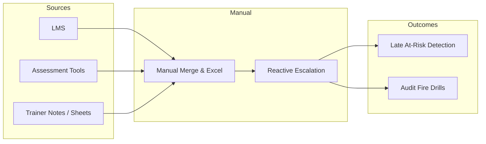
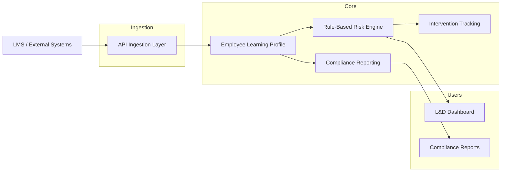
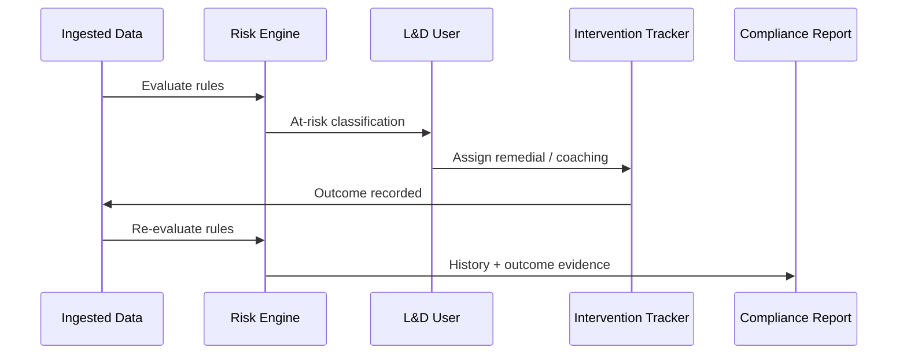

# Corporate Learning System — Problem Statement Analysis

**Document version:** 1.0  
**Date:** June 2, 2026  
**Project:** Corporate Learning Progress, Intervention & Compliance Tracking System  
**Purpose:** First deliverable per evaluation rubric — Problem Statement Analysis (10 marks)

---

## Table of Contents

1. [Executive Summary](#1-executive-summary)
2. [Problem Definition](#2-problem-definition)
3. [Stakeholders and Pain Points](#3-stakeholders-and-pain-points)
4. [Current State vs Desired State](#4-current-state-vs-desired-state)
5. [Expectations and Scope](#5-expectations-and-scope)
6. [Out of Scope](#6-out-of-scope)
7. [Future Scope](#7-future-scope)
8. [Depth of Analysis](#8-depth-of-analysis)
9. [Success Criteria and Evaluation Alignment](#9-success-criteria-and-evaluation-alignment)
10. [Assumptions, Constraints, and Open Questions](#10-assumptions-constraints-and-open-questions)
11. [Rubric Self-Check](#11-rubric-self-check)

---

## 1. Executive Summary

Organizations must demonstrate that employees meet required competencies, complete mandatory training, and remain compliant with regulatory and industry standards. Today, evidence of learning progress is scattered across learning management systems (LMS), assessment tools, spreadsheets, and informal trainer notes. By the time L&D or compliance teams notice a gap, the employee is often already out of compliance or has missed a critical certification window.

The proposed system is **not** a replacement corporate LMS. It is a **consolidation, risk-detection, and intervention-tracking layer** that ingests attendance, assessment, and competency-milestone data; applies configurable rules to flag at-risk learners early; tracks remedial actions and outcomes; and produces compliance-ready reports for auditors and leadership.

This document analyzes the official problem statement, clarifies boundaries, and establishes the analytical foundation for subsequent use cases, test cases, architecture, and proof of concept work.

---

## 2. Problem Definition

### 2.1 Core Problem (One Sentence)

**Learning and compliance data are fragmented and reviewed too late, which prevents proactive intervention and weakens organizational accountability for employee competency outcomes.**

### 2.2 Expanded Problem Statement

| Dimension | Description |
|-----------|-------------|
| **Who is affected** | Employees (learners), L&D administrators, trainers/coaches, line managers, compliance officers, and executive sponsors accountable for workforce readiness |
| **What is broken** | No single view of an employee’s training attendance, assessment performance, and competency progression; risk is discovered reactively after deadlines or audits |
| **Why it matters** | Regulatory fines, safety incidents, failed audits, skill gaps in critical roles, wasted training spend, and reputational damage |
| **When it surfaces** | At certification expiry, during annual compliance audits, after failed assessments, or when managers escalate performance issues |
| **Where data lives today** | Corporate LMS, HRIS, assessment platforms, classroom sign-in sheets, mentoring logs, and ad hoc spreadsheets |

### 2.3 Problem Symptoms (Observable)

- Trainers and L&D staff manually export and merge reports from multiple systems.
- “At-risk” employees are identified only after missing mandatory sessions or failing threshold scores.
- Interventions (coaching, remedial sessions) are logged inconsistently; effectiveness is hard to measure.
- Compliance reports require last-minute data reconciliation and are error-prone.
- Competency progression (e.g., Level 1 → Level 2) is not tracked uniformly across job roles.

### 2.4 Root Causes (Why the Problem Persists)

1. **System silos** — LMS, assessments, and HR systems were procured independently without a unified learning-risk model.
2. **Batch-oriented reporting** — Most tools optimize for course completion certificates, not continuous risk monitoring.
3. **Weak intervention workflow** — No standard object links “risk flag → assigned intervention → measured outcome.”
4. **Generic rules** — One-size-fits-all thresholds do not reflect role-specific competency requirements.
5. **Ownership gap** — L&D owns content; compliance owns audits; neither owns end-to-end “learner health.”

### 2.5 Problem vs Solution (Boundary of This Project)

| Problem (address) | Not the problem (do not conflate) |
|-------------------|-----------------------------------|
| Late detection of at-risk learners | Replacing content authoring or course delivery |
| Fragmented visibility | Building a full-featured corporate LMS |
| Untracked interventions | Payroll, performance review, or discipline workflows |
| Weak compliance evidence | Storing raw course videos or SCORM packaging |

---

## 3. Stakeholders and Pain Points

### 3.1 Primary Stakeholders

| Stakeholder | Goals | Current pain |
|-------------|-------|--------------|
| **Employee (learner)** | Clear path to required competencies; timely support | Unclear status across multiple portals; surprise remedial assignments |
| **L&D administrator** | Cohort oversight; efficient interventions | Manual reporting; no unified risk queue |
| **Trainer / coach** | Focus on learners who need help | Discovers gaps late; no structured outcome tracking |
| **Line manager** | Team readiness and compliance | Limited visibility without requesting reports |
| **Compliance officer** | Audit-ready evidence; traceability | Data gaps; inconsistent intervention records |
| **Executive sponsor** | Workforce risk and training ROI | Lagging indicators only |

### 3.2 Secondary Stakeholders

- **IT / integration team** — API connectivity, data quality, security
- **HR** — Employee identity, role, department (reference data, not full HRIS)
- **External auditors / regulators** — Evidence of training and remediation

---

## 4. Current State vs Desired State

### 4.1 Current State (As-Is)



### 4.2 Desired State (To-Be)



### 4.3 Key Transitions

| From | To |
|------|-----|
| Reactive alerts after failure | Proactive at-risk classification based on rules |
| Scattered records | Aggregated employee learning profile |
| Informal follow-up | Structured intervention history with outcomes |
| Ad hoc audit packs | Compliance-ready, repeatable reports |

---

## 5. Expectations and Scope

### 5.1 Business Expectations

The organization expects a system that:

1. **Consolidates** training attendance, periodic assessment scores, and competency-level milestones into one learner view.
2. **Identifies risk early** using transparent, configurable rules (not opaque black-box scoring in MVP).
3. **Tracks interventions** from assignment through completion and outcome.
4. **Supports compliance** with exportable, auditable reporting.
5. **Remains practical** for trainers and L&D administrators (usability over feature breadth).

### 5.2 In-Scope Capabilities (MVP / Assignment Scope)

Aligned with the official problem statement:

| # | Capability | Description |
|---|------------|-------------|
| 1 | **Data ingestion (API)** | Employee training attendance; periodic assessment scores; competency-level learning milestones |
| 2 | **Rule-based risk identification** | Configurable rules with a **defined rule definition format** (e.g., JSON/YAML) |
| 3 | **Intervention tracking** | Remedial training sessions; coaching and mentoring assignments |
| 4 | **Compliance-ready reporting** | Reports suitable for internal compliance and audit support |
| 5 | **Employee learning profile** | Aggregation of ingested data per employee |
| 6 | **Configurable risk rules** | Attendance %, score thresholds, and related criteria |
| 7 | **At-risk learner classification** | Output risk level/category per employee |
| 8 | **Intervention history & outcomes** | Record what was done and whether risk improved |
| 9 | **Dashboards or reports** | Simple views for operational and compliance users |

### 5.3 Architectural Expectations (Non-Functional)

| Area | Expectation |
|------|-------------|
| **Separation of concerns** | Clean separation of **data**, **rules**, and **reporting** (explicit evaluation parameter) |
| **Competency progression** | Correct handling of competency-level milestones (not just course completion) |
| **Rule realism** | Rules reflect real L&D scenarios (attendance + scores + milestones) |
| **Integration** | API-first ingestion; source systems remain systems of record |
| **Extensibility** | Rule format and ingestion contracts allow growth without rewriting core |

### 5.4 Data Domains (Conceptual)

| Domain | Examples |
|--------|----------|
| **Employee reference** | ID, name, department, role, job family |
| **Attendance** | Session ID, date, status (present/absent/excused), course or module |
| **Assessment** | Score, max score, assessment type, date, competency link |
| **Competency milestone** | Competency ID, target level, achieved level, effective date |
| **Risk classification** | Rule ID, severity, evaluated at, resulting status |
| **Intervention** | Type, assignee, dates, status, linked risk event, outcome notes |

### 5.5 Rule Engine Expectations (High Level)

Rules should support, at minimum:

- **Attendance-based** — e.g., attendance &lt; 80% over rolling window
- **Score-based** — e.g., score below threshold on N consecutive assessments
- **Milestone-based** — e.g., competency level not achieved by target date
- **Composite** — multiple criteria with AND/OR logic

A formal rule definition format will be specified in architecture/use-case phases; analysis establishes that rules must be **versionable, testable, and auditable**.

---

## 6. Out of Scope

Explicit boundaries prevent scope creep and align with “you are not building a full corporate LMS.”

| Out of scope | Rationale |
|--------------|-----------|
| **Full LMS** (course authoring, SCORM player, content marketplace) | Problem statement explicitly excludes |
| **Live virtual classroom / webinar hosting** | Delivery belongs in existing tools |
| **Payroll, compensation, promotion workflows** | HR systems; only reference employee identity |
| **Performance management / PIP / termination** | Legal/HR process outside learning-risk scope |
| **AI/ML predictive risk models (MVP)** | Assignment calls for **rule-based** identification first |
| **Native mobile apps** | Web dashboards/reports sufficient for POC |
| **Multi-tenant SaaS billing and provisioning** | Enterprise single-tenant POC is acceptable |
| **Real-time bi-directional sync with all HR systems** | Ingestion via API; batch acceptable for POC |
| **Automated assignment of interventions without human approval** | System tracks interventions; humans assign them (workflow may be manual in MVP) |
| **Blockchain or immutable ledger** | Standard audit logs and exports meet compliance-ready bar for MVP |
| **Replacement of source LMS/assessment systems** | This system consumes their data |

---

## 7. Future Scope

Items deferred from MVP but valuable for a production roadmap:

| Phase | Capability |
|-------|------------|
| **Near term** | CSV/file import fallback alongside APIs; email/Teams notifications on new at-risk flags |
| **Near term** | Rule simulation UI (“test rule against sample employees”) |
| **Medium term** | Manager self-service views; department-level heat maps |
| **Medium term** | Trend-based rules (declining scores over time); seasonal compliance windows |
| **Medium term** | Deeper HRIS integration (role changes triggering competency requirements) |
| **Long term** | ML-assisted risk scoring with explainability layered on rule engine |
| **Long term** | Integration with calendar systems for automatic remedial session scheduling |
| **Long term** | Multi-region regulatory rule packs (GDPR, industry-specific frameworks) |
| **Long term** | Federation across business units with centralized compliance reporting |

---

## 8. Depth of Analysis

### 8.1 Why “Early Intervention” Requires a Dedicated System

Corporate learning failure is costly in ways pure LMS metrics under-report:

- **Compliance exposure** — Missed mandatory training can halt work on regulated sites.
- **Operational risk** — Uncertified staff in safety-critical roles.
- **Training waste** — Re-training entire cohorts because individual gaps were invisible.

Early intervention means detecting **leading indicators** (attendance drift, failing assessments, stalled competency levels) before **lagging indicators** (audit finding, incident, certification lapse).

### 8.2 Competency-Level Progression (Critical Nuance)

The problem is not only “did the employee finish the course?” but “did they reach the **required competency level** for their role?”

Example progression model:

```
Role: Warehouse Operator
Competency: Forklift Safety
Levels: Awareness (L1) → Supervised Operation (L2) → Independent (L3)
Milestones ingested: L1 achieved (date), L2 in progress, L3 required by policy
Risk: L2 not achieved 30 days before L3 deadline → at-risk
```

The system must treat **milestones** as first-class data, not derive them implicitly from course completion alone.

### 8.3 Intervention Effectiveness Loop



Effectiveness is measured when **post-intervention data** (attendance, scores, milestones) shows improvement or risk level changes.

### 8.4 Risk Rule Realism (Illustrative Examples)

| Rule ID | Name | Logic (simplified) | Severity |
|---------|------|-------------------|----------|
| R-ATT-01 | Low attendance | Attendance &lt; 75% in last 30 days | High |
| R-SCR-01 | Failing streak | Score &lt; 60% on 2 consecutive assessments | High |
| R-MS-01 | Milestone slip | Required competency level not met by target date | Critical |
| R-CMP-01 | Composite | Low attendance AND score &lt; 70% on latest assessment | Medium |

Rules must be **configurable** without code changes for L&D (format-driven configuration is in scope).

### 8.5 Compliance-Ready Reporting (What “Ready” Means Here)

For MVP, compliance-ready implies:

- **Traceability** — Which data produced which risk flag at what time
- **Completeness** — Employee profile shows attendance, assessments, milestones, interventions
- **Reproducibility** — Same inputs yield same risk classification (deterministic rules)
- **Export** — PDF/CSV or structured export for auditors (format TBD in architecture)

Full legal sign-off on every jurisdiction is out of scope; the system **enables** audit evidence.

### 8.6 Technical Risks and Mitigations (Analysis)

| Risk | Impact | Mitigation direction |
|------|--------|----------------------|
| Poor data quality from APIs | False risk flags | Validation layer; ingestion error logs |
| Rule sprawl | Unmaintainable config | Rule IDs, versioning, documentation |
| Over-notification | Alert fatigue | Severity levels; deduplication windows |
| Competency model mismatch | Wrong milestones | Configurable competency catalog per role |
| Scope creep into LMS | Delayed delivery | Enforce out-of-scope list (Section 6) |

---

## 9. Success Criteria and Evaluation Alignment

### 9.1 Official Evaluation Parameters (from Problem Statement)

| Parameter | How this analysis addresses it |
|-----------|--------------------------------|
| **Realism of learning competency rules** | Section 8.4; competency progression in 8.2 |
| **Correct handling of competency-level progression** | Milestones as first-class domain (5.4, 8.2) |
| **Practical usefulness for trainers and L&D** | Stakeholder pains (3); dashboards in scope (5.2) |
| **Clean separation of data, rules, and reporting** | Architectural expectation (5.3); desired-state diagram (4.2) |

### 9.2 Measurable Success Indicators (for POC / Presentation)

| Indicator | Target (illustrative for demo) |
|-----------|-------------------------------|
| Single employee profile | Shows attendance + scores + milestones in one view |
| Rule execution | At least 3 configurable rules evaluate correctly |
| At-risk list | Generated from live or seeded ingested data |
| Intervention trail | At least one intervention linked to risk with outcome |
| Compliance export | One report export including risk + intervention history |
| Ingestion | API accepts sample payloads for all three data types |

---

## 10. Assumptions, Constraints, and Open Questions

### 10.1 Assumptions

- Source systems (LMS, assessments) can expose data via REST API or equivalent for POC (mock APIs acceptable).
- Employee master data (ID, role, department) is available for linking ingested events.
- Competency definitions and required levels per role can be configured or seeded.
- English-only UI and reports are sufficient for evaluation.
- Single organization (one tenant) for POC.

### 10.2 Constraints

- **Time-boxed delivery** — Phased: analysis → use cases → tests → architecture → POC.
- **Rule-based only in MVP** — No requirement for ML models in initial scope.
- **Not a full LMS** — Content delivery remains external.

### 10.3 Open Questions (to Resolve in Use Case / Architecture Phase)

| # | Question | Owner / Phase |
|---|----------|----------------|
| 1 | Exact JSON/YAML schema for rule definitions? | Architecture |
| 2 | Granularity of attendance (per session vs per course)? | Use cases |
| 3 | How many risk levels (e.g., Low/Medium/High/Critical)? | Use cases |
| 4 | Who can configure rules vs who can only view dashboards? | Use cases (RBAC) |
| 5 | Retention period for ingested and derived data? | Architecture / compliance |
| 6 | Minimum fields for compliance export? | Test cases + compliance stakeholder |

---

## 11. Rubric Self-Check

Mapping to **Expectations.txt** — Problem Statement Analysis (10 marks total):

| Criterion | Max | How this document addresses it |
|-----------|-----|--------------------------------|
| **Clarity of problem statement** | 2 | Section 2: one-sentence core problem, table, symptoms, root causes, problem vs solution |
| **Expectation and scope** | 2 | Sections 5–5.3: business expectations, in-scope capabilities, data domains, NFRs |
| **Out of scope and future scope** | 2 | Sections 6 and 7: explicit tables with rationale and phased roadmap |
| **Depth of analysis** | 2 | Section 8: competency progression, intervention loop, sample rules, risks, diagrams |
| **Documentation quality** | 2 | TOC, tables, mermaid diagrams, version metadata, rubric self-check |

---

## Appendix A — Source Reference

Official problem statement excerpt (project source of truth):

> Organizations are accountable for employee learning outcomes, training attendance, and compliance with regulatory bodies and industry standards. Yet learning data is fragmented across LMS platforms, assessment systems, and trainer notes. Employees who fall behind on required competencies are detected too late, and interventions are reactive. Build a digital learning progress and early-intervention tracking system that consolidates training attendance, assessment results, and competency milestones to identify at-risk learners and track intervention effectiveness.

**Scope reminder:** Not a full corporate LMS; API ingestion of attendance, assessments, milestones; rule-based risk; intervention tracking; compliance reporting.

---

## Appendix B — Document History

| Version | Date | Author | Changes |
|---------|------|--------|---------|
| 1.0 | 2026-06-02 | Project team | Initial problem statement analysis for evaluation Step 1 |

---

## Next Steps (Project Pipeline)

Per evaluation rubric, recommended order after this document:

1. **Use Case Documentation** — Actors, flows, sequence diagrams, rights/restrictions  
2. **Test Case Documentation** — Plans, FR coverage, traceability matrix  
3. **High Level Architecture** — Stack, diagrams, Dev/Test/Deploy, CI/CD  
4. **POC** — Working prototype with deployment instructions  

---

*End of document*
