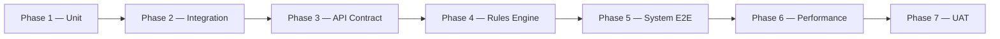

# Corporate Learning System — Test Case Documentation

**Document version:** 1.0  
**Date:** June 2, 2026  
**Project:** Corporate Learning Progress, Intervention & Compliance Tracking System  
**Purpose:** Third deliverable per evaluation rubric — Test Case Documentation (10 marks)  
**Prerequisites:**  
- `Corporate_Learning_System_Problem_Statement_Analysis.md`  
- `Corporate_Learning_System_Use_Case_Documentation.md`

---

## Table of Contents

1. [Overview](#1-overview)
2. [Functional Requirements Summary](#2-functional-requirements-summary)
3. [Test Plan](#3-test-plan)
4. [Test Environment and Data](#4-test-environment-and-data)
5. [Detailed Test Cases](#5-detailed-test-cases)
6. [Rules Engine Test Suite](#6-rules-engine-test-suite)
7. [Requirements Traceability Matrix](#7-requirements-traceability-matrix)
8. [Use Case to Test Case Mapping](#8-use-case-to-test-case-mapping)
9. [Rubric Self-Check](#9-rubric-self-check)
10. [Appendices](#10-appendices)

---

## 1. Overview

This document defines the **test strategy, test cases, and traceability** for the Corporate Learning Progress, Intervention & Compliance Tracking System. Testing validates that must-have features from the problem statement behave correctly across ingestion, profile aggregation, rule-based risk identification, intervention tracking, and compliance reporting.

### 1.1 Test Objectives

| Objective | Success measure |
|-----------|-----------------|
| Verify API ingestion for all three data types | 100% of ingestion test cases pass |
| Validate employee learning profile aggregation | Profile reflects attendance, scores, milestones |
| Confirm configurable rules fire correctly | Positive and negative rule tests pass |
| Ensure at-risk classification is deterministic | Same inputs → same risk level |
| Validate intervention lifecycle and effectiveness | End-to-end intervention tests pass |
| Confirm compliance reports are complete and exportable | Report content matches source data |
| Enforce RBAC restrictions | Unauthorized actions rejected |

### 1.2 Out of Scope for Testing (MVP)

- Full LMS course delivery, SCORM, live classrooms  
- ML/AI predictive risk models  
- Native mobile applications  
- Multi-tenant SaaS provisioning  
- Penetration testing beyond basic RBAC checks (deferred to security phase)

---

## 2. Functional Requirements Summary

Functional requirements (FR) derived from the problem statement and use cases:

| FR ID | Requirement | Priority |
|-------|-------------|----------|
| **FR-01** | System shall ingest employee training attendance records via REST API | Must |
| **FR-02** | System shall ingest periodic assessment scores via REST API | Must |
| **FR-03** | System shall ingest competency-level learning milestones via REST API | Must |
| **FR-04** | System shall validate, normalize, and deduplicate ingested records | Must |
| **FR-05** | System shall aggregate an employee learning profile from ingested data | Must |
| **FR-06** | System shall support configurable risk rules in JSON/YAML format | Must |
| **FR-07** | System shall classify at-risk learners using rule-based evaluation | Must |
| **FR-08** | System shall track remedial training and coaching/mentoring interventions with outcomes | Must |
| **FR-09** | System shall generate and export compliance-ready reports | Must |
| **FR-10** | System shall provide dashboards for L&D, trainers, and employees | Must |
| **FR-11** | System shall enforce role-based access control | Must |
| **FR-12** | System shall manage competency catalog and level progression | Must |
| **FR-13** | System shall version risk rules and maintain audit trail | Should |
| **FR-14** | System shall measure intervention effectiveness after re-evaluation | Must |
| **FR-15** | System shall handle inactive/terminated employees without new risk flags | Must |

---

## 3. Test Plan

### 3.1 Test Levels

| Level | Scope | Tools / approach | Owner |
|-------|-------|------------------|-------|
| **Unit** | Validation logic, rule condition evaluators, profile roll-up calculations, permission checks | Automated unit tests (e.g., JUnit, pytest, Jest — stack TBD in architecture) | Development |
| **Integration** | Ingestion pipeline → DB → profile engine → risk engine; intervention service → reporting | API tests against test DB; test containers | Development / QA |
| **API contract** | REST ingestion endpoints, auth, request/response schemas | OpenAPI schema validation; Postman/Newman or Pact | QA / Integrator |
| **Rules engine** | Rule parsing, positive/negative firing, composite AND/OR, versioning | Golden-file rule fixtures; dry-run API | QA / L&D (UAT sample rules) |
| **System / E2E** | Full flows: ingest → profile → risk → intervention → report | Seeded data; browser or API-driven E2E | QA |
| **Performance** | Risk evaluation at scale; dashboard load | Load test (e.g., k6, JMeter) | QA / DevOps |
| **UAT** | L&D and compliance workflows | Scripted scenarios with business users | L&D / Compliance |

### 3.2 Test Phases

| Phase | Entry criteria | Exit criteria |
|-------|----------------|---------------|
| Unit | Code complete for module | ≥90% pass on rule and profile calculators |
| Integration | DB schema deployed to test env | Ingestion → profile → risk chain passes |
| API contract | OpenAPI spec published | All contract tests green |
| Rules engine | Sample rule library seeded | All TC-RISK-* pass |
| System E2E | POC deployable to test | Critical path E2E scenarios pass |
| Performance | 1000+ employee seed data | Risk run &lt; 2 min for 1000 profiles |
| UAT | UAT scripts approved | L&D sign-off on 3 core scenarios |

### 3.3 Test Types Matrix

| Area | Unit | Integration | Contract | E2E | Performance |
|------|:----:|:-----------:|:--------:|:---:|:-----------:|
| Ingestion (FR-01–04) | ✓ | ✓ | ✓ | ✓ | — |
| Profile (FR-05) | ✓ | ✓ | — | ✓ | ✓ |
| Rules (FR-06–07, FR-13) | ✓ | ✓ | — | ✓ | ✓ |
| Interventions (FR-08, FR-14) | ✓ | ✓ | — | ✓ | — |
| Reporting (FR-09) | ✓ | ✓ | — | ✓ | — |
| Dashboards (FR-10) | — | ✓ | — | ✓ | ✓ |
| RBAC (FR-11) | ✓ | ✓ | ✓ | ✓ | — |
| Competency (FR-12) | ✓ | ✓ | — | ✓ | — |

### 3.4 Defect Severity

| Severity | Definition | Example |
|----------|------------|---------|
| **Critical** | Data loss, wrong compliance export, security bypass | Employee sees another employee's PII |
| **High** | Core feature broken | At-risk list empty when rules should fire |
| **Medium** | Workaround exists | Dashboard filter incorrect |
| **Low** | Cosmetic / minor | Label typo on export |

### 3.5 Regression Strategy

- **Smoke suite:** Run on every CI build (ingestion happy path, one rule fire, one report export).  
- **Full regression:** Before POC demo and release candidate.  
- **Rule golden files:** Any change to rule schema or evaluator requires re-run of Section 6 suite.

---

## 4. Test Environment and Data

### 4.1 Environments

| Environment | Purpose |
|-------------|---------|
| **Local / Dev** | Developer unit and integration tests |
| **Test / QA** | Full test execution, contract tests, E2E |
| **Staging** | UAT, demo rehearsal |
| **Production** | Post-go-live smoke only |

### 4.2 Test Data Sets

| Dataset | Description |
|---------|-------------|
| **EMP-ACTIVE-01** | Active employee, good attendance, passing scores, L2 milestone achieved |
| **EMP-RISK-ATT-01** | Active employee, attendance 74% (below 75% threshold) |
| **EMP-RISK-SCR-01** | Two consecutive assessment scores 55% and 58% |
| **EMP-RISK-MS-01** | Required L3 milestone not met by target date |
| **EMP-BOUNDARY-01** | Exactly 75% attendance (boundary — should NOT fire &lt;75% rule) |
| **EMP-INACTIVE-01** | Terminated employee; historical data only |
| **EMP-DUP-01** | Duplicate attendance payload for idempotency tests |
| **EMP-PROG-01** | L1 → L2 → L3 progression over time |
| **BATCH-1000** | 1000 active employee profiles for performance test |

### 4.3 Sample Rule Fixtures (for rules tests)

| Rule ID | Condition | Expected fire on |
|---------|-----------|------------------|
| R-ATT-01 | attendance &lt; 75% / 30 days | EMP-RISK-ATT-01 |
| R-SCR-01 | 2 consecutive scores &lt; 60% | EMP-RISK-SCR-01 |
| R-MS-01 | milestone not met by target date | EMP-RISK-MS-01 |
| R-CMP-01 | attendance &lt; 80% AND latest score &lt; 70% | Composite test employee |

---

## 5. Detailed Test Cases

**Priority:** P1 = Must pass for MVP | P2 = Should pass | P3 = Nice to have  

**Legend — Test levels:** U = Unit, I = Integration, C = Contract, E = E2E, P = Performance

---

### 5.1 Ingestion (FR-01 – FR-04)

#### TC-INGEST-001 — Valid attendance record ingestion

| Field | Value |
|-------|-------|
| **Use case** | UC-INGEST-001 |
| **FR** | FR-01, FR-04 |
| **Priority** | P1 |
| **Level** | C, E |
| **Description** | POST valid attendance payload for known employee |
| **Preconditions** | Employee EMP-ACTIVE-01 exists; API key valid |
| **Steps** | 1. POST `/api/v1/attendance` with employeeId, sessionId, courseId, date, status=present. 2. Verify HTTP 202 and ingestionId. 3. Query data store for record. |
| **Expected result** | Record persisted with status validated; profile aggregation queued |

#### TC-INGEST-002 — Unknown employee rejection

| Field | Value |
|-------|-------|
| **Use case** | UC-INGEST-001 |
| **FR** | FR-01, FR-04 |
| **Priority** | P1 |
| **Level** | C, I |
| **Description** | Reject attendance for non-existent employee ID |
| **Preconditions** | Employee ID `EMP-UNKNOWN-999` not in reference data |
| **Steps** | 1. POST attendance with unknown employeeId. |
| **Expected result** | HTTP 422; error logged to ingestion error queue; no profile update |

#### TC-INGEST-003 — Duplicate attendance idempotency

| Field | Value |
|-------|-------|
| **Use case** | UC-INGEST-001, UC-INGEST-004 |
| **FR** | FR-04 |
| **Priority** | P1 |
| **Level** | I, E |
| **Description** | Duplicate session+employee+date handled without double-count |
| **Preconditions** | EMP-DUP-01; identical payload sent twice |
| **Steps** | 1. POST same attendance twice. 2. Count attendance records. 3. Verify profile attendance %. |
| **Expected result** | Single logical record; second request idempotent (200/202); attendance % not doubled |

#### TC-INGEST-004 — Valid assessment score ingestion

| Field | Value |
|-------|-------|
| **Use case** | UC-INGEST-002 |
| **FR** | FR-02 |
| **Priority** | P1 |
| **Level** | C, E |
| **Description** | POST valid assessment with score and maxScore |
| **Preconditions** | EMP-ACTIVE-01 exists |
| **Steps** | 1. POST score=85, maxScore=100, assessmentType=quiz, competencyId linked. |
| **Expected result** | Record stored; normalized percentage 85%; profile refresh queued |

#### TC-INGEST-005 — Assessment score exceeds maximum

| Field | Value |
|-------|-------|
| **Use case** | UC-INGEST-002 |
| **FR** | FR-02, FR-04 |
| **Priority** | P1 |
| **Level** | C, U |
| **Description** | Reject score greater than maxScore |
| **Preconditions** | Valid employee |
| **Steps** | 1. POST score=110, maxScore=100. |
| **Expected result** | HTTP 400 with field error; no record persisted |

#### TC-INGEST-006 — Valid competency milestone ingestion

| Field | Value |
|-------|-------|
| **Use case** | UC-INGEST-003 |
| **FR** | FR-03, FR-12 |
| **Priority** | P1 |
| **Level** | C, E |
| **Description** | POST milestone with achieved level L2 |
| **Preconditions** | Competency C-FORKLIFT in catalog; EMP-PROG-01 |
| **Steps** | 1. POST competencyId, achievedLevel=L2, effectiveDate, status=achieved. |
| **Expected result** | Milestone history appended; profile shows L2 achieved |

#### TC-INGEST-007 — Unknown competency rejection

| Field | Value |
|-------|-------|
| **Use case** | UC-INGEST-003 |
| **FR** | FR-03, FR-12 |
| **Priority** | P1 |
| **Level** | C, I |
| **Description** | Reject milestone with invalid competency ID |
| **Preconditions** | competencyId not in catalog |
| **Steps** | 1. POST milestone with unknown competencyId. |
| **Expected result** | HTTP 422; error queue entry; suggestion to sync catalog |

#### TC-INGEST-008 — Ingestion error reconciliation replay

| Field | Value |
|-------|-------|
| **Use case** | UC-INGEST-005 |
| **FR** | FR-04 |
| **Priority** | P2 |
| **Level** | E |
| **Description** | Integrator replays failed record after fixing employee reference |
| **Preconditions** | TC-INGEST-002 error in queue; employee subsequently added |
| **Steps** | 1. Add employee to reference data. 2. Replay failed payload from error queue. |
| **Expected result** | Record validates; removed from error queue; profile updated |

---

### 5.2 Profile Aggregation (FR-05, FR-12, FR-15)

#### TC-PROFILE-001 — Profile aggregates all three data domains

| Field | Value |
|-------|-------|
| **Use case** | UC-PROFILE-001 |
| **FR** | FR-05 |
| **Priority** | P1 |
| **Level** | I, E |
| **Description** | Single profile shows attendance, assessments, milestones |
| **Preconditions** | EMP-ACTIVE-01 has all three data types ingested |
| **Steps** | 1. Trigger profile aggregation. 2. Load profile via API/UI. |
| **Expected result** | Profile contains attendance %, score history, competency levels, calculated_at timestamp |

#### TC-PROFILE-002 — Attendance roll-up over 30-day window

| Field | Value |
|-------|-------|
| **Use case** | UC-PROFILE-001 |
| **FR** | FR-05 |
| **Priority** | P1 |
| **Level** | U, I |
| **Description** | Correct attendance percentage for rolling window |
| **Preconditions** | 8 of 10 sessions present in last 30 days |
| **Steps** | 1. Run aggregation. |
| **Expected result** | attendance_percentage = 80% |

#### TC-PROFILE-003 — Competency level progression on profile

| Field | Value |
|-------|-------|
| **Use case** | UC-PROFILE-001, UC-ADMIN-001 |
| **FR** | FR-05, FR-12 |
| **Priority** | P1 |
| **Level** | E |
| **Description** | Profile reflects L1 → L2 → L3 progression over time |
| **Preconditions** | EMP-PROG-01 with sequential milestone ingestions |
| **Steps** | 1. Ingest L1 achieved, then L2 in_progress, then L2 achieved. 2. Refresh profile. |
| **Expected result** | Timeline shows progression; current level L2; gap to required L3 visible if applicable |

#### TC-PROFILE-004 — Employee self-view restricted to own profile

| Field | Value |
|-------|-------|
| **Use case** | UC-PROFILE-002, UC-DASH-003 |
| **FR** | FR-10, FR-11 |
| **Priority** | P1 |
| **Level** | E |
| **Description** | Employee can view own profile only |
| **Preconditions** | User logged in as EMP-ACTIVE-01 |
| **Steps** | 1. Navigate to my learning profile. 2. Attempt to access another employee ID via URL/API. |
| **Expected result** | Own profile displayed; other employee access returns 403 |

#### TC-PROFILE-005 — Inactive employee excluded from new risk evaluation

| Field | Value |
|-------|-------|
| **Use case** | UC-PROFILE-003 |
| **FR** | FR-15 |
| **Priority** | P1 |
| **Level** | I, E |
| **Description** | Terminated employee not classified at-risk on new runs |
| **Preconditions** | EMP-INACTIVE-01 status=terminated; poor attendance data ingested |
| **Steps** | 1. Run risk evaluation batch. 2. Query at-risk queue. |
| **Expected result** | EMP-INACTIVE-01 not in at-risk queue; historical profile read-only |

---

### 5.3 Risk Rules and Classification (FR-06, FR-07, FR-13)

#### TC-RISK-001 — Configure valid attendance rule (JSON)

| Field | Value |
|-------|-------|
| **Use case** | UC-RISK-001 |
| **FR** | FR-06 |
| **Priority** | P1 |
| **Level** | E |
| **Description** | L&D admin saves valid R-ATT-01 rule as draft |
| **Preconditions** | L&D Administrator logged in |
| **Steps** | 1. Open rule editor. 2. Paste valid JSON for attendance &lt; 75%. 3. Save draft. |
| **Expected result** | Draft saved with version 1; schema validation passes |

#### TC-RISK-002 — Reject invalid rule syntax

| Field | Value |
|-------|-------|
| **Use case** | UC-RISK-001 |
| **FR** | FR-06 |
| **Priority** | P1 |
| **Level** | U, E |
| **Description** | Invalid JSON/YAML rejected at save |
| **Preconditions** | L&D Administrator logged in |
| **Steps** | 1. Submit rule with missing required field `conditions`. |
| **Expected result** | Validation error displayed; rule not saved |

#### TC-RISK-003 — Dry-run rule before activation

| Field | Value |
|-------|-------|
| **Use case** | UC-RISK-002 |
| **FR** | FR-06 |
| **Priority** | P2 |
| **Level** | E |
| **Description** | Dry-run shows expected employees flagged |
| **Preconditions** | Draft R-ATT-01; EMP-RISK-ATT-01 in sample set |
| **Steps** | 1. Run dry-run against sample employees. |
| **Expected result** | EMP-RISK-ATT-01 listed as would-fire; EMP-ACTIVE-01 not listed |

#### TC-RISK-004 — Attendance rule fires (positive)

| Field | Value |
|-------|-------|
| **Use case** | UC-RISK-003, UC-RISK-004 |
| **FR** | FR-07 |
| **Priority** | P1 |
| **Level** | I, E |
| **Description** | Employee with 74% attendance classified High per R-ATT-01 |
| **Preconditions** | R-ATT-01 active; EMP-RISK-ATT-01 profile at 74% |
| **Steps** | 1. Execute risk batch. 2. Query risk assessment for employee. |
| **Expected result** | Rule R-ATT-01 fired; severity HIGH; evidence shows 74% |

#### TC-RISK-005 — Attendance boundary does not fire (negative)

| Field | Value |
|-------|-------|
| **Use case** | UC-RISK-003 |
| **FR** | FR-07 |
| **Priority** | P1 |
| **Level** | U, I |
| **Description** | Exactly 75% attendance does not fire &lt;75% rule |
| **Preconditions** | R-ATT-01 active; EMP-BOUNDARY-01 at exactly 75% |
| **Steps** | 1. Execute risk batch. |
| **Expected result** | R-ATT-01 does not fire for EMP-BOUNDARY-01 |

#### TC-RISK-006 — Consecutive low score rule fires

| Field | Value |
|-------|-------|
| **Use case** | UC-RISK-003 |
| **FR** | FR-07 |
| **Priority** | P1 |
| **Level** | I, E |
| **Description** | Two consecutive scores &lt; 60% triggers R-SCR-01 |
| **Preconditions** | R-SCR-01 active; EMP-RISK-SCR-01 with scores 55%, 58% |
| **Steps** | 1. Execute risk batch. |
| **Expected result** | R-SCR-01 fired; assessment evidence attached |

#### TC-RISK-007 — Milestone slip rule fires (Critical)

| Field | Value |
|-------|-------|
| **Use case** | UC-RISK-003, UC-RISK-004 |
| **FR** | FR-07, FR-12 |
| **Priority** | P1 |
| **Level** | E |
| **Description** | Required competency level not met by target date |
| **Preconditions** | R-MS-01 active; EMP-RISK-MS-01 past target date without L3 |
| **Steps** | 1. Execute risk batch. |
| **Expected result** | R-MS-01 fired; composite risk level Critical |

#### TC-RISK-008 — Composite AND rule fires

| Field | Value |
|-------|-------|
| **Use case** | UC-RISK-003 |
| **FR** | FR-07 |
| **Priority** | P1 |
| **Level** | I |
| **Description** | Composite rule requires both low attendance AND low score |
| **Preconditions** | R-CMP-01 active; employee with 78% attendance and 65% latest score |
| **Steps** | 1. Execute risk batch. |
| **Expected result** | R-CMP-01 fires (both conditions met) |

#### TC-RISK-009 — Composite rule partial match does not fire

| Field | Value |
|-------|-------|
| **Use case** | UC-RISK-003 |
| **FR** | FR-07 |
| **Priority** | P1 |
| **Level** | U, I |
| **Description** | Only one of two AND conditions met |
| **Preconditions** | R-CMP-01 active; 78% attendance but latest score 85% |
| **Steps** | 1. Execute risk batch. |
| **Expected result** | R-CMP-01 does not fire |

#### TC-RISK-010 — Rule version change mid-quarter uses correct version

| Field | Value |
|-------|-------|
| **Use case** | UC-RISK-006 |
| **FR** | FR-13 |
| **Priority** | P1 |
| **Level** | E |
| **Description** | Assessments retain rule version ID; mid-quarter change applies only to new runs |
| **Preconditions** | R-ATT-01 v1 (threshold 75%) run on Day 1; v2 (threshold 80%) activated Day 45 of quarter |
| **Steps** | 1. Run batch on Day 1; store assessment A. 2. Activate v2 on Day 45. 3. Run batch Day 46. 4. Query audit trail. |
| **Expected result** | Assessment A references rule v1; Day 46 run uses v2; both versions in audit history |

#### TC-RISK-011 — At-risk queue filter by severity

| Field | Value |
|-------|-------|
| **Use case** | UC-RISK-005 |
| **FR** | FR-07, FR-10 |
| **Priority** | P1 |
| **Level** | E |
| **Description** | L&D filters queue to Critical only |
| **Preconditions** | Multiple employees at High and Critical |
| **Steps** | 1. Open at-risk queue. 2. Filter severity=Critical. |
| **Expected result** | Only Critical employees shown; counts match dashboard |

#### TC-RISK-012 — Risk evaluation performance (1000 profiles)

| Field | Value |
|-------|-------|
| **Use case** | UC-RISK-003 |
| **FR** | FR-07 |
| **Priority** | P1 |
| **Level** | P |
| **Description** | Batch risk run completes within SLA |
| **Preconditions** | BATCH-1000 seeded; 5 active rules |
| **Steps** | 1. Start risk batch. 2. Measure elapsed time to completion. |
| **Expected result** | Completes in &lt; 2 minutes; all profiles evaluated |

---

### 5.4 Interventions (FR-08, FR-14)

#### TC-INT-001 — Assign remedial training linked to risk

| Field | Value |
|-------|-------|
| **Use case** | UC-INTERVENTION-001 |
| **FR** | FR-08 |
| **Priority** | P1 |
| **Level** | E |
| **Description** | L&D assigns remedial session to at-risk employee |
| **Preconditions** | EMP-RISK-ATT-01 at High; L&D logged in |
| **Steps** | 1. Select employee from queue. 2. Create remedial session with date and trainer. 3. Save. |
| **Expected result** | Intervention status=assigned; linked to riskAssessmentId |

#### TC-INT-002 — Assign coaching intervention

| Field | Value |
|-------|-------|
| **Use case** | UC-INTERVENTION-002 |
| **FR** | FR-08 |
| **Priority** | P1 |
| **Level** | E |
| **Description** | Assign mentoring with coach and check-in schedule |
| **Preconditions** | At-risk employee; Trainer logged in |
| **Steps** | 1. Create coaching intervention type. 2. Assign coach. |
| **Expected result** | Intervention recorded; visible on trainer dashboard |

#### TC-INT-003 — Track intervention progress states

| Field | Value |
|-------|-------|
| **Use case** | UC-INTERVENTION-003 |
| **FR** | FR-08 |
| **Priority** | P1 |
| **Level** | E |
| **Description** | Status transitions assigned → in_progress → completed |
| **Preconditions** | TC-INT-001 intervention exists |
| **Steps** | 1. Trainer marks in_progress with notes. 2. Complete session. |
| **Expected result** | Status history preserved; timestamps recorded |

#### TC-INT-004 — Record intervention outcome triggers re-evaluation

| Field | Value |
|-------|-------|
| **Use case** | UC-INTERVENTION-004, UC-INTERVENTION-005 |
| **FR** | FR-08, FR-14 |
| **Priority** | P1 |
| **Level** | E |
| **Description** | Outcome recorded and effectiveness job queued |
| **Preconditions** | Completed remedial session |
| **Steps** | 1. Record outcome=successful. 2. Ingest improved attendance. 3. Run risk batch. |
| **Expected result** | InterventionOutcome stored; effectiveness=improved if risk downgraded |

#### TC-INT-005 — Intervention history on compliance report

| Field | Value |
|-------|-------|
| **Use case** | UC-INTERVENTION-001–005, UC-REPORT-001 |
| **FR** | FR-08, FR-09 |
| **Priority** | P1 |
| **Level** | E |
| **Description** | Compliance report includes intervention trail |
| **Preconditions** | Employee with risk flag and completed intervention |
| **Steps** | 1. Generate compliance report for period. |
| **Expected result** | Report lists risk event, intervention type, dates, outcome, effectiveness |

---

### 5.5 Reporting and Dashboards (FR-09, FR-10)

#### TC-REPORT-001 — Generate compliance report for period

| Field | Value |
|-------|-------|
| **Use case** | UC-REPORT-001 |
| **FR** | FR-09 |
| **Priority** | P1 |
| **Level** | E |
| **Description** | Compliance officer generates report with traceability metadata |
| **Preconditions** | Compliance Officer logged in; Q1 data seeded |
| **Steps** | 1. Select period Q1, department=All. 2. Generate report. |
| **Expected result** | Report includes profiles summary, risk counts, rule versions, intervention summary, runId, generatedAt |

#### TC-REPORT-002 — Export compliance report to CSV

| Field | Value |
|-------|-------|
| **Use case** | UC-REPORT-002 |
| **FR** | FR-09 |
| **Priority** | P1 |
| **Level** | E |
| **Description** | Export generated report as CSV |
| **Preconditions** | TC-REPORT-001 report generated |
| **Steps** | 1. Click Export CSV. 2. Verify download. |
| **Expected result** | Valid CSV file; export logged in audit trail with user and timestamp |

#### TC-REPORT-003 — Audit trail for risk decision reproducibility

| Field | Value |
|-------|-------|
| **Use case** | UC-REPORT-003 |
| **FR** | FR-09, FR-13 |
| **Priority** | P2 |
| **Level** | E |
| **Description** | Audit view shows inputs and rule version for risk flag |
| **Preconditions** | Prior risk run with fired rules |
| **Steps** | 1. Search audit by employee and date. |
| **Expected result** | Displays metrics, ruleId, ruleVersion, outcome; same inputs reproduce same classification |

#### TC-DASH-001 — L&D dashboard at-risk counts

| Field | Value |
|-------|-------|
| **Use case** | UC-DASH-001 |
| **FR** | FR-10 |
| **Priority** | P1 |
| **Level** | E |
| **Description** | Dashboard shows severity breakdown matching queue |
| **Preconditions** | Known at-risk seed counts |
| **Steps** | 1. Open L&D dashboard. |
| **Expected result** | Critical/High/Medium/Low counts match database |

#### TC-DASH-002 — Trainer cohort dashboard scope

| Field | Value |
|-------|-------|
| **Use case** | UC-DASH-002 |
| **FR** | FR-10, FR-11 |
| **Priority** | P1 |
| **Level** | E |
| **Description** | Trainer sees only assigned cohort |
| **Preconditions** | Trainer T1 assigned Cohort A only |
| **Steps** | 1. Login as T1. 2. View cohort dashboard. |
| **Expected result** | Only Cohort A at-risk employees shown |

#### TC-DASH-003 — Ingestion health on L&D dashboard

| Field | Value |
|-------|-------|
| **Use case** | UC-DASH-001, UC-INGEST-005 |
| **FR** | FR-10 |
| **Priority** | P2 |
| **Level** | E |
| **Description** | Dashboard reflects ingestion error count |
| **Preconditions** | 3 records in error queue |
| **Steps** | 1. Open L&D dashboard ingestion widget. |
| **Expected result** | Error count = 3; link to reconciliation view |

---

### 5.6 RBAC and Admin (FR-11, FR-12)

#### TC-RBAC-001 — Compliance officer cannot configure rules

| Field | Value |
|-------|-------|
| **Use case** | UC-RISK-001 |
| **FR** | FR-11 |
| **Priority** | P1 |
| **Level** | E |
| **Description** | Segregation of duties enforced |
| **Preconditions** | Compliance Officer logged in |
| **Steps** | 1. Attempt POST to rule configuration API/UI. |
| **Expected result** | HTTP 403; no rule created |

#### TC-RBAC-002 — Trainer cannot export compliance report

| Field | Value |
|-------|-------|
| **Use case** | UC-REPORT-002 |
| **FR** | FR-11 |
| **Priority** | P1 |
| **Level** | E |
| **Description** | Export restricted to Compliance Officer |
| **Preconditions** | Trainer logged in |
| **Steps** | 1. Attempt export compliance report. |
| **Expected result** | HTTP 403 |

#### TC-RBAC-003 — Trainer PII masking on profile view

| Field | Value |
|-------|-------|
| **Use case** | UC-PROFILE-002 |
| **FR** | FR-11 |
| **Priority** | P2 |
| **Level** | E |
| **Description** | Trainer sees masked contact fields |
| **Preconditions** | Trainer viewing cohort employee profile |
| **Steps** | 1. Open employee profile as trainer. |
| **Expected result** | Learning data visible; personal contact fields masked or hidden |

#### TC-ADMIN-001 — Competency catalog drives milestone validation

| Field | Value |
|-------|-------|
| **Use case** | UC-ADMIN-001 |
| **FR** | FR-12 |
| **Priority** | P1 |
| **Level** | I, E |
| **Description** | Required level per role used in profile gap calculation |
| **Preconditions** | Role Warehouse Operator requires Forklift L3; employee at L2 |
| **Steps** | 1. Configure catalog. 2. Aggregate profile. |
| **Expected result** | Profile shows gap: required L3, current L2 |

---

## 6. Rules Engine Test Suite

Dedicated suite for **FR-06** and **FR-07** (referenced in architecture continuous testing as golden files).

### 6.1 Positive Tests (rule should fire)

| Test ID | Rule | Input profile | Expected |
|---------|------|---------------|----------|
| RE-POS-01 | R-ATT-01 | attendance 74% / 30d | FIRE, HIGH |
| RE-POS-02 | R-SCR-01 | scores 55%, 58% consecutive | FIRE, HIGH |
| RE-POS-03 | R-MS-01 | L3 required, target date passed, at L2 | FIRE, CRITICAL |
| RE-POS-04 | R-CMP-01 | attendance 78%, latest score 65% | FIRE, MEDIUM |

### 6.2 Negative Tests (rule should not fire)

| Test ID | Rule | Input profile | Expected |
|---------|------|---------------|----------|
| RE-NEG-01 | R-ATT-01 | attendance 75% exactly | NO FIRE |
| RE-NEG-02 | R-ATT-01 | attendance 74% but outside 30d window | NO FIRE |
| RE-NEG-03 | R-SCR-01 | one score 55%, next 62% | NO FIRE |
| RE-NEG-04 | R-CMP-01 | low attendance, high score 90% | NO FIRE |
| RE-NEG-05 | R-MS-01 | L3 achieved before target date | NO FIRE |
| RE-NEG-06 | Any | inactive employee | NO FIRE (FR-15) |

### 6.3 Performance Test

| Test ID | Description | Target |
|---------|-------------|--------|
| RE-PERF-01 | Evaluate 5 rules × 1000 profiles | &lt; 2 minutes (TC-RISK-012) |
| RE-PERF-02 | Single rule dry-run 500 employees | &lt; 10 seconds |

### 6.4 Determinism Test

| Test ID | Description | Expected |
|---------|-------------|----------|
| RE-DET-01 | Run same profile + rule set twice | Identical risk assessment output and level |

---

## 7. Requirements Traceability Matrix

**Feature → Use Case → Test Case**

| Feature (problem statement) | FR | Use case(s) | Test case IDs |
|------------------------------|-----|-------------|---------------|
| API ingestion — attendance | FR-01 | UC-INGEST-001 | TC-INGEST-001, 002, 003, 008 |
| API ingestion — assessments | FR-02 | UC-INGEST-002 | TC-INGEST-004, 005 |
| API ingestion — milestones | FR-03 | UC-INGEST-003 | TC-INGEST-006, 007 |
| Validation / normalization | FR-04 | UC-INGEST-004, 005 | TC-INGEST-003, 005, 008 |
| Employee learning profile | FR-05 | UC-PROFILE-001, 002 | TC-PROFILE-001, 002, 003, 004 |
| Configurable risk rules | FR-06 | UC-RISK-001, 002, 006 | TC-RISK-001, 002, 003, 010; RE-POS/NEG suite |
| At-risk classification | FR-07 | UC-RISK-003, 004, 005 | TC-RISK-004–009, 011, 012; RE-POS/NEG |
| Intervention tracking | FR-08 | UC-INTERVENTION-001–004 | TC-INT-001, 002, 003, 005 |
| Compliance reporting | FR-09 | UC-REPORT-001–003 | TC-REPORT-001, 002, 003; TC-INT-005 |
| Dashboards / reports | FR-10 | UC-DASH-001–003 | TC-DASH-001, 002, 003; TC-RISK-011 |
| RBAC | FR-11 | UC-PROFILE-002, UC-RISK-001 | TC-RBAC-001, 002, 003; TC-PROFILE-004 |
| Competency progression | FR-12 | UC-ADMIN-001, UC-INGEST-003 | TC-PROFILE-003, TC-ADMIN-001; TC-RISK-007 |
| Rule versioning / audit | FR-13 | UC-RISK-006, UC-REPORT-003 | TC-RISK-010, TC-REPORT-003 |
| Intervention effectiveness | FR-14 | UC-INTERVENTION-005 | TC-INT-004 |
| Inactive employees | FR-15 | UC-PROFILE-003 | TC-PROFILE-005; RE-NEG-06 |

### 7.1 Coverage Summary

| FR ID | # Test cases | Covered |
|-------|--------------|---------|
| FR-01 | 4 | ✓ |
| FR-02 | 2 | ✓ |
| FR-03 | 2 | ✓ |
| FR-04 | 4 | ✓ |
| FR-05 | 4 | ✓ |
| FR-06 | 6+ | ✓ |
| FR-07 | 10+ | ✓ |
| FR-08 | 5 | ✓ |
| FR-09 | 4 | ✓ |
| FR-10 | 4 | ✓ |
| FR-11 | 4 | ✓ |
| FR-12 | 4 | ✓ |
| FR-13 | 2 | ✓ |
| FR-14 | 1 | ✓ |
| FR-15 | 2 | ✓ |

**Total detailed test cases:** 38 (TC-*) + 13 rules engine sub-tests (RE-*) = **51** executable scenarios.

---

## 8. Use Case to Test Case Mapping

| Use case | Test cases |
|----------|------------|
| UC-INGEST-001 | TC-INGEST-001, 002, 003 |
| UC-INGEST-002 | TC-INGEST-004, 005 |
| UC-INGEST-003 | TC-INGEST-006, 007 |
| UC-INGEST-004 | TC-INGEST-003, 005 |
| UC-INGEST-005 | TC-INGEST-008, TC-DASH-003 |
| UC-PROFILE-001 | TC-PROFILE-001, 002, 003 |
| UC-PROFILE-002 | TC-PROFILE-004, TC-RBAC-003 |
| UC-PROFILE-003 | TC-PROFILE-005 |
| UC-RISK-001 | TC-RISK-001, 002, TC-RBAC-001 |
| UC-RISK-002 | TC-RISK-003 |
| UC-RISK-003 | TC-RISK-004–009, 012; RE-* suite |
| UC-RISK-004 | TC-RISK-004, 007, 011 |
| UC-RISK-005 | TC-RISK-011 |
| UC-RISK-006 | TC-RISK-010, TC-REPORT-003 |
| UC-INTERVENTION-001 | TC-INT-001, 005 |
| UC-INTERVENTION-002 | TC-INT-002 |
| UC-INTERVENTION-003 | TC-INT-003 |
| UC-INTERVENTION-004 | TC-INT-004 |
| UC-INTERVENTION-005 | TC-INT-004 |
| UC-REPORT-001 | TC-REPORT-001, TC-INT-005 |
| UC-REPORT-002 | TC-REPORT-002, TC-RBAC-002 |
| UC-REPORT-003 | TC-REPORT-003 |
| UC-DASH-001 | TC-DASH-001, 003 |
| UC-DASH-002 | TC-DASH-002 |
| UC-DASH-003 | TC-PROFILE-004 |
| UC-ADMIN-001 | TC-ADMIN-001, TC-PROFILE-003, TC-RISK-007 |

**Use case coverage:** 26 / 26 use cases mapped to at least one test case.

---

## 9. Rubric Self-Check

Mapping to **Expectations.txt** — Test Case Documentation (10 marks total):

| Criterion | Max | How this document addresses it |
|-----------|-----|--------------------------------|
| **Test plan and cases** | 2 | Section 3 (levels, phases, types); Section 5 (38 detailed TC-* cases) |
| **Use case related tests** | 2 | Section 8: all 26 use cases mapped to test IDs |
| **Functional requirements** | 2 | Section 2 (FR-01–FR-15); every FR covered in Section 7.1 |
| **Traceability matrix** | 2 | Section 7: Feature → FR → Use Case → Test Case |
| **Documentation quality** | 2 | TOC, consistent TC template, test data, rules suite, rubric self-check |

---

## 10. Appendices

### Appendix A — Edge Case Checklist

| Edge case (required) | Test case(s) |
|---------------------|--------------|
| Competency-level progression | TC-PROFILE-003, TC-RISK-007, TC-ADMIN-001 |
| Boundary attendance threshold (75%) | TC-RISK-005, RE-NEG-01 |
| Boundary score thresholds | TC-RISK-006, RE-NEG-03 |
| Inactive employees | TC-PROFILE-005, RE-NEG-06 |
| Duplicate API records | TC-INGEST-003 |
| Rule version change mid-quarter | TC-RISK-010 |

### Appendix B — CI Smoke Test Subset (recommended)

Run on every build:

1. TC-INGEST-001  
2. TC-INGEST-004  
3. TC-PROFILE-001  
4. TC-RISK-004  
5. TC-RISK-005  
6. TC-INT-001  
7. TC-REPORT-001  
8. TC-RBAC-001  

### Appendix C — Document History

| Version | Date | Author | Changes |
|---------|------|--------|---------|
| 1.0 | 2026-06-02 | Project team | Initial test case documentation for evaluation Step 3 |

### Appendix D — Next Steps (Project Pipeline)

Per evaluation rubric:

1. **High Level Architecture** — Stack, C4 diagrams, Dev/Test/Deploy, CI/CD (integrate Section 3 and Appendix B into pipeline design)  
2. **POC** — Implement and execute test cases against working prototype  

---

*End of document*
