# Corporate Learning System — Use Case Documentation

**Document version:** 1.0  
**Date:** June 2, 2026  
**Project:** Corporate Learning Progress, Intervention & Compliance Tracking System  
**Purpose:** Second deliverable per evaluation rubric — Use Case Documentation (10 marks)  
**Prerequisite:** `Corporate_Learning_System_Problem_Statement_Analysis.md`

---

## Table of Contents

1. [Overview](#1-overview)
2. [Actors and Roles](#2-actors-and-roles)
3. [System Context](#3-system-context)
4. [Use Case Catalog](#4-use-case-catalog)
5. [Detailed Use Cases](#5-detailed-use-cases)
6. [User Flows](#6-user-flows)
7. [Sequence Diagrams](#7-sequence-diagrams)
8. [Permissions, Restrictions, and Rights (RBAC)](#8-permissions-restrictions-and-rights-rbac)
9. [Completeness and Traceability](#9-completeness-and-traceability)
10. [Rubric Self-Check](#10-rubric-self-check)
11. [Appendices](#11-appendices)

---

## 1. Overview

This document defines the functional behavior of the **Corporate Learning Progress, Intervention & Compliance Tracking System** from an actor perspective. The system is **not** a full corporate LMS; it consolidates learning data from external sources, evaluates configurable risk rules, tracks interventions, and produces compliance-ready reports.

### 1.1 Scope of This Document

| In scope | Out of scope (see problem statement analysis) |
|----------|-----------------------------------------------|
| API ingestion of attendance, assessments, milestones | Course authoring, SCORM delivery, live classrooms |
| Employee learning profile aggregation | Payroll, performance management, termination |
| Configurable rule-based risk identification | ML/AI predictive risk (MVP) |
| Intervention assignment and outcome tracking | Automated intervention without human approval |
| Dashboards and compliance exports | Native mobile apps, multi-tenant SaaS billing |

### 1.2 Design Decisions (Resolved from Analysis)

| Topic | Decision | Rationale |
|-------|----------|-----------|
| Attendance granularity | **Per training session**, roll-up to course/module | Matches classroom and LMS session records |
| Risk levels | **Low, Medium, High, Critical** | Supports prioritization without alert fatigue |
| Rule configuration | **JSON/YAML** format, versioned | Problem statement requires defined rule format |
| Intervention approval | **Human assignment required** | L&D/trainer assigns; system tracks lifecycle |
| Employee PII | **Masked in trainer views** where policy requires | GDPR/enterprise PII handling |

---

## 2. Actors and Roles

### 2.1 Primary Actors

| Actor | Description | Primary goals |
|-------|-------------|---------------|
| **Employee (Learner)** | Staff member required to complete training and competencies | View own progress; understand remedial requirements |
| **Trainer / Coach** | Delivers training, coaching, or mentoring | Identify learners needing support; record session outcomes |
| **L&D Administrator** | Owns learning programs, rules, and cohort oversight | Configure rules; manage at-risk queue; assign interventions |
| **Compliance Officer** | Ensures regulatory and policy adherence | Generate audit-ready reports; verify intervention evidence |
| **Line Manager** | Supervises team readiness (read-only in MVP) | View team compliance summary without configuring rules |
| **System Integrator** | Connects LMS, assessment, and HR reference data | Configure API ingestion; monitor data quality |

### 2.2 Secondary Actors

| Actor | Description |
|-------|-------------|
| **External LMS / Assessment System** | Source of record for attendance, scores, and milestones via REST API |
| **HR Reference System** | Provides employee ID, role, department (read-only sync) |
| **System (Batch Scheduler)** | Automated jobs for ingestion, profile refresh, and risk evaluation |

### 2.3 Actor–Capability Matrix (Summary)

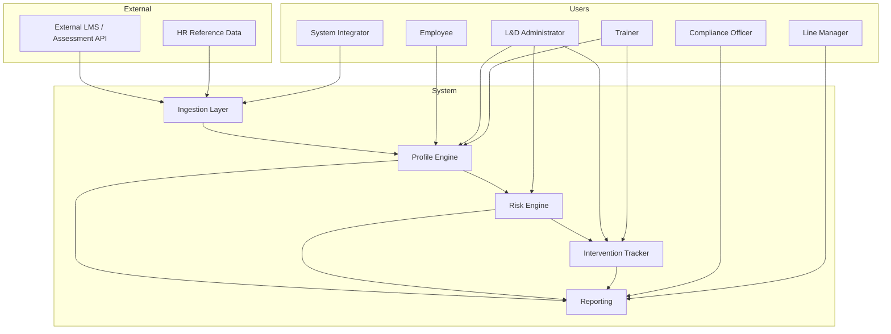

---

## 3. System Context

### 3.1 Context Diagram

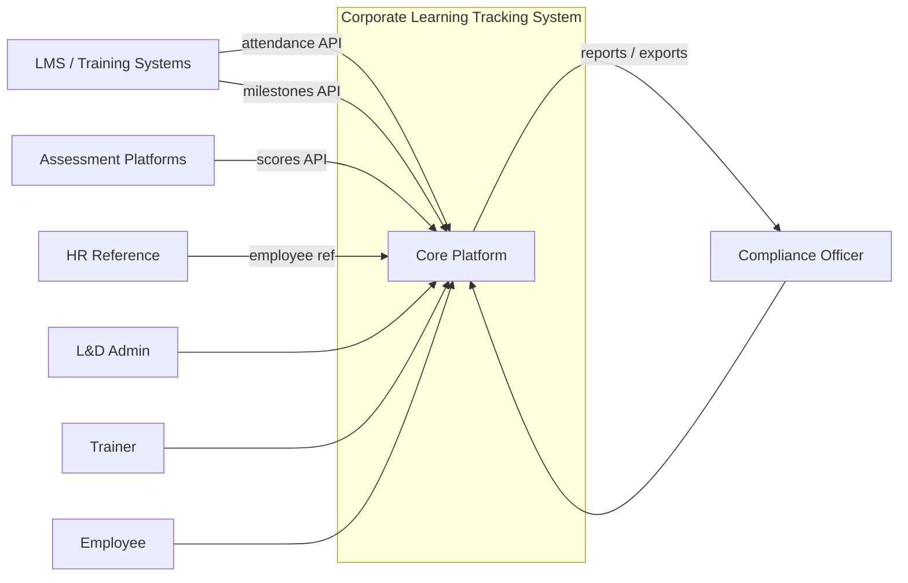

### 3.2 Functional Boundaries

The system maintains **clean separation** of three concerns (evaluation parameter):

| Layer | Responsibility | Primary use cases |
|-------|----------------|-------------------|
| **Data** | Ingestion, validation, storage, profile aggregation | UC-INGEST-*, UC-PROFILE-* |
| **Rules** | Rule definition, versioning, evaluation, classification | UC-RISK-* |
| **Reporting** | Dashboards, compliance exports, audit views | UC-REPORT-*, UC-DASH-* |

Intervention tracking spans **data** (intervention records) and **rules** (re-evaluation after outcome).

---

## 4. Use Case Catalog

| ID | Name | Primary actor | Priority |
|----|------|---------------|----------|
| **UC-INGEST-001** | Ingest training attendance records | System Integrator / External API | Must |
| **UC-INGEST-002** | Ingest periodic assessment scores | System Integrator / External API | Must |
| **UC-INGEST-003** | Ingest competency-level milestones | System Integrator / External API | Must |
| **UC-INGEST-004** | Validate and normalize ingested data | System (automated) | Must |
| **UC-INGEST-005** | Reconcile ingestion errors | System Integrator | Should |
| **UC-PROFILE-001** | Aggregate employee learning profile | System (automated) | Must |
| **UC-PROFILE-002** | View employee learning profile | L&D Administrator, Trainer, Employee | Must |
| **UC-PROFILE-003** | Sync employee reference data | System Integrator | Must |
| **UC-RISK-001** | Configure risk rule | L&D Administrator | Must |
| **UC-RISK-002** | Test risk rule before activation | L&D Administrator | Should |
| **UC-RISK-003** | Execute scheduled risk evaluation | System (automated) | Must |
| **UC-RISK-004** | Classify at-risk learners | System (automated) | Must |
| **UC-RISK-005** | View at-risk learner queue | L&D Administrator, Trainer | Must |
| **UC-RISK-006** | Version and audit risk rules | L&D Administrator, Compliance Officer | Should |
| **UC-INTERVENTION-001** | Assign remedial training session | L&D Administrator, Trainer | Must |
| **UC-INTERVENTION-002** | Assign coaching or mentoring | L&D Administrator, Trainer | Must |
| **UC-INTERVENTION-003** | Track intervention progress | Trainer, L&D Administrator | Must |
| **UC-INTERVENTION-004** | Record intervention outcome | Trainer, L&D Administrator | Must |
| **UC-INTERVENTION-005** | Measure intervention effectiveness | System (automated) / L&D Administrator | Must |
| **UC-REPORT-001** | Generate compliance report | Compliance Officer | Must |
| **UC-REPORT-002** | Export compliance report | Compliance Officer | Must |
| **UC-REPORT-003** | View audit trail for risk decisions | Compliance Officer, L&D Administrator | Should |
| **UC-DASH-001** | L&D operational dashboard | L&D Administrator | Must |
| **UC-DASH-002** | Trainer cohort dashboard | Trainer | Must |
| **UC-DASH-003** | Employee learning status self-view | Employee | Should |
| **UC-ADMIN-001** | Manage competency catalog | L&D Administrator | Must |

**Total:** 26 use cases covering all must-have features from the problem statement.

---

## 5. Detailed Use Cases

### 5.1 Data Ingestion

#### UC-INGEST-001 — Ingest Training Attendance Records

| Field | Description |
|-------|-------------|
| **Primary actor** | External LMS API (initiated by System Integrator configuration) |
| **Preconditions** | Employee exists in reference data; API credentials configured; attendance payload schema registered |
| **Main flow** | 1. External system sends POST with employee ID, session ID, course/module ID, date, status (present/absent/excused). 2. System validates schema and employee ID. 3. System stores raw attendance record with source timestamp and correlation ID. 4. System queues profile aggregation for affected employee. 5. System returns 202 Accepted with ingestion ID. |
| **Alternate flows** | **A1 — Duplicate record:** Same session + employee + date → update if source timestamp newer; else idempotent 200. **A2 — Unknown employee:** Reject with 422; log to ingestion error queue. **A3 — Invalid status:** Reject with 400 and field-level errors. |
| **Postconditions** | Attendance stored; aggregation job queued; audit log entry created |

#### UC-INGEST-002 — Ingest Periodic Assessment Scores

| Field | Description |
|-------|-------------|
| **Primary actor** | External Assessment API |
| **Preconditions** | Employee and competency link (if applicable) resolvable |
| **Main flow** | 1. External system POSTs employee ID, assessment ID, score, max score, assessment type, date, optional competency ID. 2. System validates score range (0 ≤ score ≤ max). 3. System normalizes to percentage where needed. 4. System persists record and queues profile refresh. |
| **Alternate flows** | **A1 — Score exceeds max:** Reject 400. **A2 — Future-dated assessment:** Reject or flag per policy (default: reject). |
| **Postconditions** | Assessment score available for profile and rule evaluation |

#### UC-INGEST-003 — Ingest Competency-Level Milestones

| Field | Description |
|-------|-------------|
| **Primary actor** | External LMS / Competency API |
| **Preconditions** | Competency ID exists in competency catalog; employee role mapped to required levels |
| **Main flow** | 1. External system POSTs employee ID, competency ID, achieved level, target level (optional), effective date, status (achieved/in_progress/not_started). 2. System validates level against catalog (e.g., L1–L5). 3. System updates milestone history (append-only). 4. System queues profile aggregation. |
| **Alternate flows** | **A1 — Level regression without approval:** Flag for L&D review; still store with audit note. **A2 — Unknown competency:** Reject 422; suggest catalog sync. |
| **Postconditions** | Milestone history updated; competency progression visible on profile |

#### UC-INGEST-004 — Validate and Normalize Ingested Data

| Field | Description |
|-------|-------------|
| **Primary actor** | System (automated, part of ingestion pipeline) |
| **Preconditions** | Raw record received from UC-INGEST-001/002/003 |
| **Main flow** | 1. Apply schema validation. 2. Normalize dates to UTC. 3. Deduplicate by business key. 4. Mark record `validated` or `rejected`. 5. Emit metrics (success/failure counts). |
| **Postconditions** | Only validated records feed profile engine |

#### UC-INGEST-005 — Reconcile Ingestion Errors

| Field | Description |
|-------|-------------|
| **Primary actor** | System Integrator |
| **Preconditions** | Errors logged in ingestion error queue |
| **Main flow** | 1. Integrator views error dashboard. 2. Identifies root cause (mapping, missing employee, schema drift). 3. Fixes source mapping or employee reference. 4. Replays failed records or requests source resend. |
| **Postconditions** | Error queue reduced; data completeness improved |

---

### 5.2 Employee Learning Profile

#### UC-PROFILE-001 — Aggregate Employee Learning Profile

| Field | Description |
|-------|-------------|
| **Primary actor** | System (automated after ingestion or on schedule) |
| **Preconditions** | Validated attendance, assessment, and/or milestone data exists |
| **Main flow** | 1. Load employee reference (role, department). 2. Roll up attendance % by rolling window (30/90 days) and by mandatory course. 3. Aggregate latest and consecutive assessment scores per competency. 4. Compute competency level vs required level for role. 5. Persist aggregated profile snapshot with `calculated_at` timestamp. |
| **Alternate flows** | **A1 — Partial data:** Profile marked incomplete; risk rules skip metrics with insufficient data. |
| **Postconditions** | Single profile view ready for dashboards and risk engine |

#### UC-PROFILE-002 — View Employee Learning Profile

| Field | Description |
|-------|-------------|
| **Primary actor** | L&D Administrator, Trainer, Employee (self) |
| **Preconditions** | Profile aggregated for employee |
| **Main flow** | 1. Actor searches by employee ID or name. 2. System displays attendance summary, assessment history, competency progression timeline, current risk status, open interventions. 3. Actor drills into source records if permitted. |
| **Alternate flows** | **A1 — Trainer view:** PII masked per policy (e.g., hide home contact). **A2 — Employee self-view:** Own record only. |
| **Postconditions** | Actor has unified learner view |

#### UC-PROFILE-003 — Sync Employee Reference Data

| Field | Description |
|-------|-------------|
| **Primary actor** | System Integrator |
| **Preconditions** | HR API or seed file available |
| **Main flow** | 1. Integrator configures sync schedule. 2. System imports employee ID, name, department, role, job family, employment status. 3. Inactive employees flagged; no new risk classifications for terminated staff. |
| **Postconditions** | Ingested events link to correct employee context |

---

### 5.3 Risk Rules and Classification

#### UC-RISK-001 — Configure Risk Rule

| Field | Description |
|-------|-------------|
| **Primary actor** | L&D Administrator |
| **Preconditions** | Administrator holds `RULE_CONFIGURE` permission |
| **Main flow** | 1. Administrator opens rule editor. 2. Defines rule ID, name, severity, conditions (metric, operator, value, period), applicable roles/competencies. 3. Saves as draft in JSON/YAML. 4. Submits for activation (see UC-RISK-002 optional). |
| **Alternate flows** | **A1 — Invalid syntax:** Editor shows validation errors against rule schema. |
| **Postconditions** | Draft rule stored with version number |

**Example rule fragment (attendance):**

```json
{
  "ruleId": "R-ATT-01",
  "ruleName": "Low Mandatory Training Attendance",
  "severity": "HIGH",
  "conditions": {
    "operator": "AND",
    "criteria": [
      {
        "metric": "attendance_percentage",
        "scope": "mandatory_courses",
        "period": "30_days",
        "operator": "less_than",
        "value": 75
      }
    ]
  },
  "applicableTo": { "roles": ["all"], "competencies": "all" }
}
```

#### UC-RISK-002 — Test Risk Rule Before Activation

| Field | Description |
|-------|-------------|
| **Primary actor** | L&D Administrator |
| **Preconditions** | Draft rule exists; sample or production profiles available |
| **Main flow** | 1. Administrator selects draft rule and sample employee set. 2. System runs dry-run evaluation. 3. System shows which employees would be flagged and why. 4. Administrator activates or revises rule. |
| **Postconditions** | Rule status = `active` with effective date, or remains draft |

#### UC-RISK-003 — Execute Scheduled Risk Evaluation

| Field | Description |
|-------|-------------|
| **Primary actor** | System (batch scheduler, e.g., daily) |
| **Preconditions** | Active rules exist; profiles calculated |
| **Main flow** | 1. Scheduler triggers risk run. 2. Engine loads active rule set (version pinned). 3. For each active employee profile, evaluate all applicable rules. 4. Persist risk assessment per rule fired. 5. Compute composite risk level (max severity wins; tie-break by rule priority). |
| **Postconditions** | At-risk classifications updated; notifications optional (future scope) |

#### UC-RISK-004 — Classify At-Risk Learners

| Field | Description |
|-------|-------------|
| **Primary actor** | System (output of UC-RISK-003) |
| **Preconditions** | Risk evaluation complete |
| **Main flow** | 1. Assign risk level: Low / Medium / High / Critical. 2. Link firing rules and evidence metrics to classification. 3. Update at-risk queue. 4. Clear prior classification if no rules fire (resolved state). |
| **Postconditions** | At-risk list available for UC-RISK-005 and dashboards |

#### UC-RISK-005 — View At-Risk Learner Queue

| Field | Description |
|-------|-------------|
| **Primary actor** | L&D Administrator, Trainer |
| **Preconditions** | Classifications exist |
| **Main flow** | 1. Actor opens at-risk queue filtered by severity, department, competency. 2. System lists employees with rule evidence summary. 3. Actor selects employee to assign intervention or view profile. |
| **Postconditions** | Actor can act on prioritized list |

#### UC-RISK-006 — Version and Audit Risk Rules

| Field | Description |
|-------|-------------|
| **Primary actor** | L&D Administrator, Compliance Officer (read) |
| **Preconditions** | Rule change history enabled |
| **Main flow** | 1. Administrator modifies rule → new version created; prior version archived. 2. Compliance officer views who changed what and when. 3. Historical assessments retain rule version ID for reproducibility. |
| **Postconditions** | Audit trail supports compliance questions |

---

### 5.4 Intervention Tracking

#### UC-INTERVENTION-001 — Assign Remedial Training Session

| Field | Description |
|-------|-------------|
| **Primary actor** | L&D Administrator, Trainer |
| **Preconditions** | Employee classified at-risk; actor has `INTERVENTION_ASSIGN` |
| **Main flow** | 1. Actor selects employee from at-risk queue. 2. Creates remedial session (course/module, scheduled date, trainer). 3. Links intervention to risk assessment ID and firing rules. 4. Sets status = `assigned`. |
| **Postconditions** | Intervention record created; visible on profile and compliance trail |

#### UC-INTERVENTION-002 — Assign Coaching or Mentoring

| Field | Description |
|-------|-------------|
| **Primary actor** | L&D Administrator, Trainer |
| **Preconditions** | Same as UC-INTERVENTION-001 |
| **Main flow** | 1. Actor selects intervention type = coaching or mentoring. 2. Assigns coach/mentor, start date, expected check-ins. 3. Links to risk event. 4. Status = `assigned`. |
| **Postconditions** | Coaching/mentoring tracked alongside remedial sessions |

#### UC-INTERVENTION-003 — Track Intervention Progress

| Field | Description |
|-------|-------------|
| **Primary actor** | Trainer, L&D Administrator |
| **Preconditions** | Intervention in `assigned` or `in_progress` |
| **Main flow** | 1. Actor updates session attendance, notes, partial completion. 2. Status transitions: assigned → in_progress → completed / cancelled. |
| **Alternate flows** | **A1 — Employee no-show:** Record absence; may trigger additional risk flag. |
| **Postconditions** | Current intervention state accurate |

#### UC-INTERVENTION-004 — Record Intervention Outcome

| Field | Description |
|-------|-------------|
| **Primary actor** | Trainer, L&D Administrator |
| **Preconditions** | Intervention completed or closed |
| **Main flow** | 1. Actor records outcome (successful, partial, unsuccessful), summary notes, follow-up required flag. 2. System stores outcome linked to intervention and risk ID. 3. Triggers profile re-evaluation job (UC-INTERVENTION-005). |
| **Postconditions** | Outcome available for compliance and effectiveness measurement |

#### UC-INTERVENTION-005 — Measure Intervention Effectiveness

| Field | Description |
|-------|-------------|
| **Primary actor** | System (automated); L&D Administrator reviews |
| **Preconditions** | Outcome recorded; post-intervention data ingested |
| **Main flow** | 1. After outcome, system waits for next ingestion/risk cycle. 2. Re-runs risk rules on updated profile. 3. Compares risk level before vs after intervention. 4. Marks intervention effectiveness (improved / unchanged / worsened). 5. L&D views effectiveness report. |
| **Postconditions** | Demonstrates proactive loop from problem statement |

---

### 5.5 Compliance Reporting and Dashboards

#### UC-REPORT-001 — Generate Compliance Report

| Field | Description |
|-------|-------------|
| **Primary actor** | Compliance Officer |
| **Preconditions** | Actor has `REPORT_GENERATE`; data for reporting period exists |
| **Main flow** | 1. Officer selects period, department, competency filter. 2. System compiles profiles, risk classifications, interventions, rule versions used. 3. System produces structured report with traceability metadata. |
| **Postconditions** | Report ready for review and export |

#### UC-REPORT-002 — Export Compliance Report

| Field | Description |
|-------|-------------|
| **Primary actor** | Compliance Officer |
| **Preconditions** | Report generated (UC-REPORT-001) |
| **Main flow** | 1. Officer selects format (PDF, CSV). 2. System exports with timestamp, run ID, user ID. 3. Download logged in audit trail. |
| **Postconditions** | Audit-ready artifact delivered |

#### UC-REPORT-003 — View Audit Trail for Risk Decisions

| Field | Description |
|-------|-------------|
| **Primary actor** | Compliance Officer, L&D Administrator |
| **Preconditions** | Audit logging enabled |
| **Main flow** | 1. Actor searches by employee, date, rule ID. 2. System shows input metrics, rule version, outcome, intervention links. |
| **Postconditions** | Reproducibility demonstrated for auditors |

#### UC-DASH-001 — L&D Operational Dashboard

| Field | Description |
|-------|-------------|
| **Primary actor** | L&D Administrator |
| **Main flow** | Dashboard shows: at-risk counts by severity, open interventions, ingestion health, rule firings trend, competency gap summary. |
| **Postconditions** | Operational visibility for L&D |

#### UC-DASH-002 — Trainer Cohort Dashboard

| Field | Description |
|-------|-------------|
| **Primary actor** | Trainer |
| **Main flow** | Dashboard shows assigned cohort at-risk list, upcoming remedial sessions, coaching assignments, outcome pending count. |
| **Postconditions** | Trainer-focused actionable view |

#### UC-DASH-003 — Employee Learning Status Self-View

| Field | Description |
|-------|-------------|
| **Primary actor** | Employee |
| **Main flow** | Employee views own attendance %, recent scores, competency levels, assigned remedial actions (no access to others' data or rule configuration). |
| **Postconditions** | Transparency for learner |

#### UC-ADMIN-001 — Manage Competency Catalog

| Field | Description |
|-------|-------------|
| **Primary actor** | L&D Administrator |
| **Main flow** | 1. Define competency ID, name, levels (L1–Ln), required level per role. 2. Catalog drives milestone validation and milestone-based rules. |
| **Postconditions** | Competency progression handled consistently |

---

## 6. User Flows

### 6.1 L&D Administrator — Daily Operations

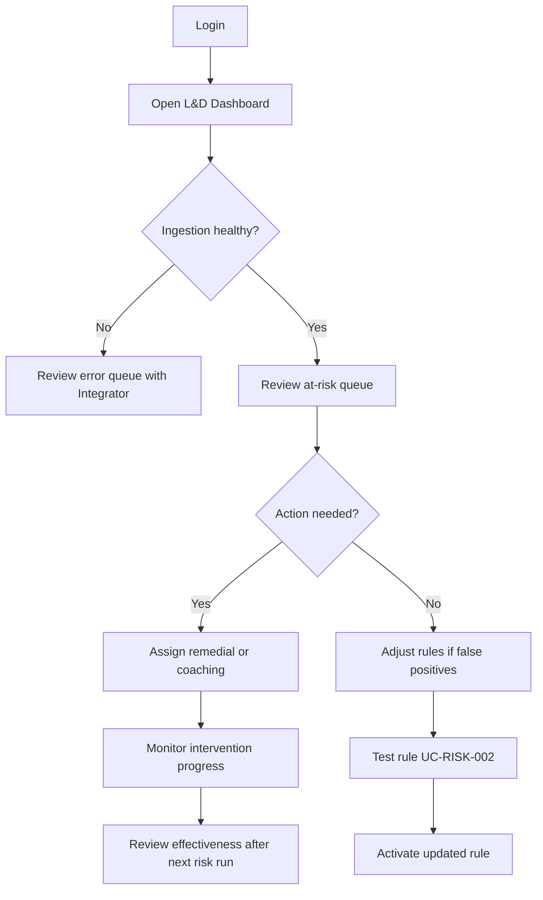

### 6.2 Trainer — Intervention Delivery

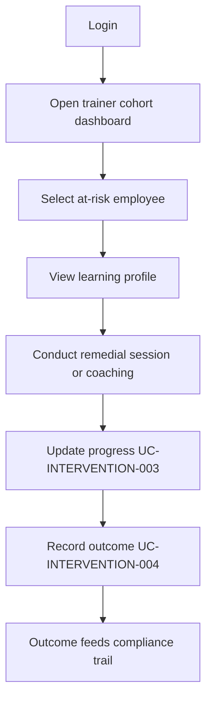

### 6.3 Compliance Officer — Audit Preparation

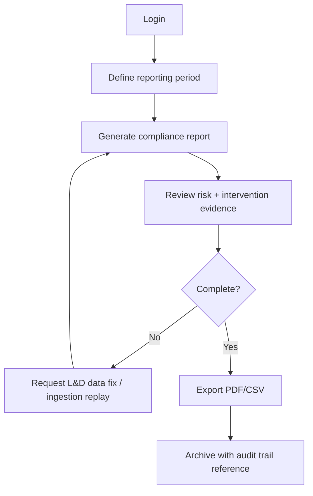

### 6.4 System Integrator — Onboarding Data Sources

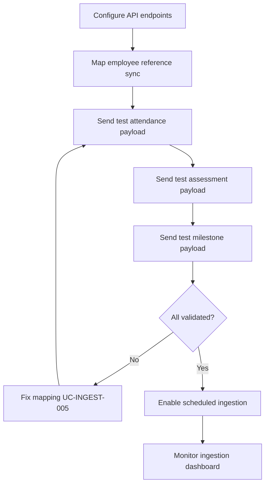

### 6.5 Employee — Self-Service Status Check

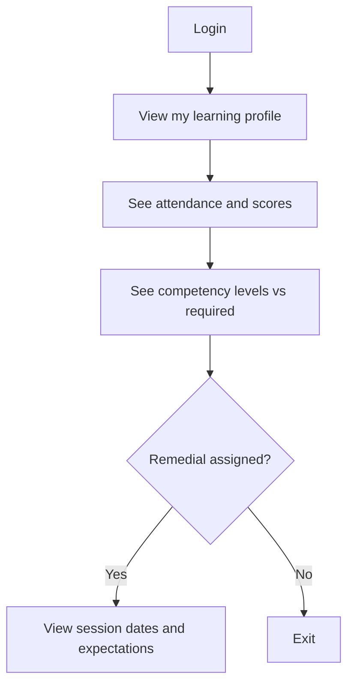

---

## 7. Sequence Diagrams

### 7.1 Daily Batch — Ingestion, Validation, Profile Update

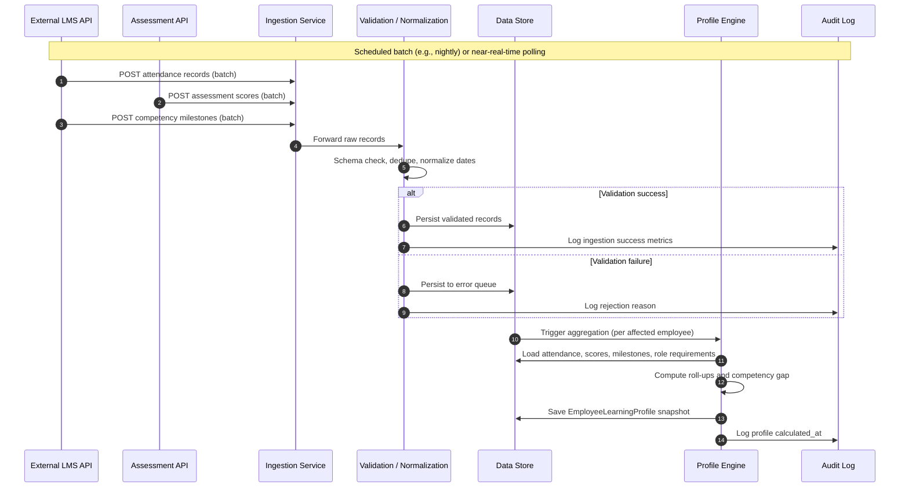

### 7.2 Risk Engine Run — Evaluate Rules and Classify At-Risk Learners

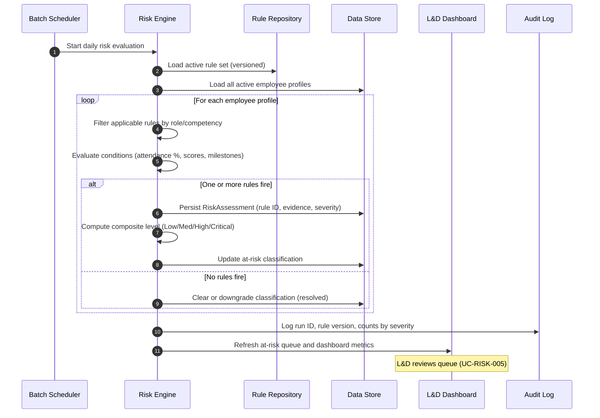

### 7.3 Intervention Lifecycle — Assign, Execute, Outcome, Effectiveness

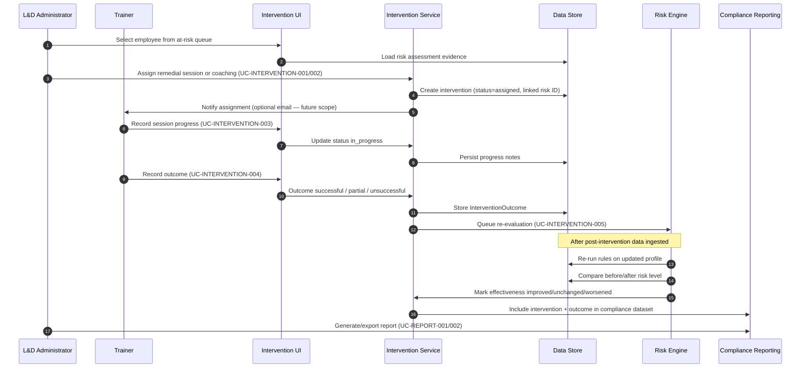

---

## 8. Permissions, Restrictions, and Rights (RBAC)

### 8.1 Permission Model

Roles are **cumulative**; one user may hold multiple roles. Deny-by-default applies to all actions not explicitly granted.

### 8.2 Permissions Matrix

| Permission / Action | Employee | Trainer | Line Manager | L&D Admin | Compliance Officer | System Integrator |
|---------------------|:--------:|:-------:|:------------:|:---------:|:------------------:|:-----------------:|
| View own learning profile | ✓ | — | — | — | — | — |
| View assigned cohort profiles | — | ✓ | — | ✓ | — | — |
| View all employee profiles | — | — | ✓ (team only) | ✓ | ✓ (read) | — |
| View full PII (contact, etc.) | Own | Masked | Team summary | ✓ | ✓ | — |
| Configure ingestion / API | — | — | — | — | — | ✓ |
| Sync employee reference data | — | — | — | — | — | ✓ |
| Manage competency catalog | — | — | — | ✓ | — | — |
| Configure / activate risk rules | — | — | — | ✓ | — | — |
| Test rules (dry-run) | — | — | — | ✓ | — | — |
| View rule audit history | — | — | — | ✓ | ✓ | — |
| View at-risk queue | — | ✓ (cohort) | ✓ (team) | ✓ | ✓ | — |
| Assign interventions | — | ✓ | — | ✓ | — | — |
| Record intervention progress/outcome | — | ✓ | — | ✓ | — | — |
| L&D operational dashboard | — | — | — | ✓ | — | — |
| Trainer cohort dashboard | — | ✓ | — | ✓ | — | — |
| Generate compliance reports | — | — | — | — | ✓ | — |
| Export compliance reports | — | — | — | — | ✓ | — |
| View risk decision audit trail | — | — | — | ✓ | ✓ | — |
| Replay / reconcile ingestion errors | — | — | — | — | — | ✓ |

### 8.3 Restrictions and Data Rights

| Restriction | Description |
|-------------|-------------|
| **Employee isolation** | Employees cannot view other employees' profiles or at-risk lists. |
| **Trainer scope** | Trainers see only cohorts or courses assigned to them unless granted L&D Admin role. |
| **Manager scope** | Line managers see aggregated team compliance; cannot edit rules or assign interventions in MVP unless also Trainer/L&D. |
| **Compliance read-mostly** | Compliance Officer cannot configure rules or assign interventions; ensures segregation of duties. |
| **Rule changes** | Only L&D Administrator; all changes versioned and audited. |
| **Export control** | Compliance exports logged with user, timestamp, filter criteria. |
| **Inactive employees** | No new interventions; historical data retained per retention policy (architecture phase). |
| **PII minimization** | Trainers see work-necessary fields; full PII for Compliance/L&D only. |

### 8.4 Authentication and Session (Assumptions)

- Enterprise SSO or username/password for POC.
- Session timeout after inactivity (e.g., 30 minutes).
- API ingestion uses service accounts / API keys separate from human roles.

---

## 9. Completeness and Traceability

### 9.1 Must-Have Feature Coverage

| Problem statement must-have | Use cases |
|----------------------------|-----------|
| Employee learning profile aggregation | UC-PROFILE-001, UC-PROFILE-002 |
| Configurable risk rules (attendance %, score thresholds) | UC-RISK-001, UC-RISK-002, UC-RISK-006 |
| At-risk learner classification | UC-RISK-003, UC-RISK-004, UC-RISK-005 |
| Intervention history and outcome tracking | UC-INTERVENTION-001 through UC-INTERVENTION-005 |
| Simple dashboards or reports | UC-DASH-001, UC-DASH-002, UC-DASH-003, UC-REPORT-* |
| API ingestion (attendance, assessments, milestones) | UC-INGEST-001 through UC-INGEST-005 |
| Rule-based risk identification | UC-RISK-001 through UC-RISK-006 |
| Remedial training + coaching/mentoring | UC-INTERVENTION-001, UC-INTERVENTION-002 |
| Compliance-ready reporting | UC-REPORT-001, UC-REPORT-002, UC-REPORT-003 |
| Competency-level progression | UC-INGEST-003, UC-ADMIN-001, UC-PROFILE-001 |

### 9.2 Evaluation Parameter Alignment

| Evaluation parameter | Use case evidence |
|---------------------|-------------------|
| Realism of learning competency rules | UC-RISK-001 (milestone + score + attendance metrics); UC-ADMIN-001 |
| Correct competency-level progression | UC-INGEST-003, UC-PROFILE-001, milestone conditions in UC-RISK-003 |
| Practical usefulness for trainers/L&D | UC-DASH-001/002, UC-RISK-005, UC-INTERVENTION-003/004 |
| Clean separation of data, rules, reporting | Section 3.2; ingestion/profile vs UC-RISK-* vs UC-REPORT-* |

### 9.3 Open Questions Closed in This Document

| # | Question (from analysis) | Resolution |
|---|--------------------------|------------|
| 1 | Rule JSON/YAML schema detail | Partial in UC-RISK-001; full schema in architecture phase |
| 2 | Attendance granularity | Per session with roll-up (Section 1.2) |
| 3 | Risk levels | Low / Medium / High / Critical (Section 1.2) |
| 4 | Rule config vs dashboard viewers | RBAC matrix (Section 8.2) |

---

## 10. Rubric Self-Check

Mapping to **Expectations.txt** — Use Case Documentation (10 marks total):

| Criterion | Max | How this document addresses it |
|-----------|-----|--------------------------------|
| **User flows and actors** | 2 | Section 2 (7 actors); Section 6 (5 end-to-end flows) |
| **Sequence diagrams** | 2 | Section 7: ingestion batch, risk run, intervention lifecycle (Mermaid) |
| **User restrictions and rights** | 2 | Section 8: RBAC matrix, restrictions, segregation of duties |
| **Completeness** | 2 | 26 use cases; Section 9.1 maps all must-haves from problem statement |
| **Documentation quality** | 2 | TOC, consistent UC template, version metadata, diagrams, rubric self-check |

---

## 11. Appendices

### Appendix A — Use Case Dependency Overview

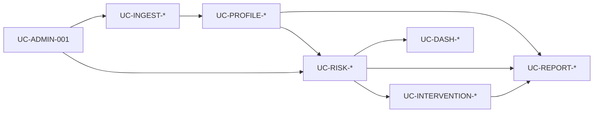

### Appendix B — Document History

| Version | Date | Author | Changes |
|---------|------|--------|---------|
| 1.0 | 2026-06-02 | Project team | Initial use case documentation for evaluation Step 2 |

### Appendix C — Next Steps (Project Pipeline)

Per evaluation rubric, recommended order after this document:

1. **Test Case Documentation** — Test plan, FR coverage, traceability matrix (UC → test mapping)  
2. **High Level Architecture** — Stack, C4 diagrams, Dev/Test/Deploy, CI/CD  
3. **POC** — Working prototype with deployment instructions  

---

*End of document*
